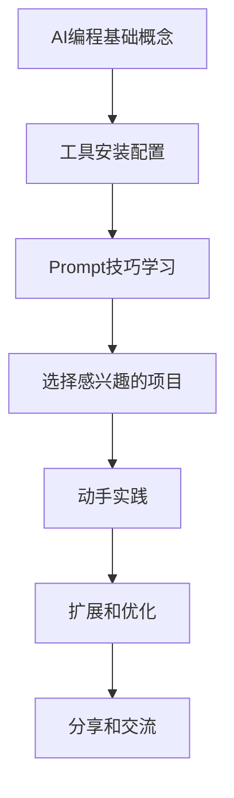

# 📚 AI编程书籍

## 🚀 项目简介

欢迎来到《AI编程书籍》开源项目！这是一本专注于AI编程的系统性、全面性、实践性书籍，旨在帮助技术和非技术人员掌握最新的AI编程工具，开发各种类型的应用程序。

本书采用通俗易懂的方式，通过大量实操案例，带你体验AI编程的极致效率和无穷魅力。从基础概念到技术落地，从问题解决到职业发展，为你构建完整的AI编程知识体系。

## 🎯 目标读者

- **技术人员**：希望提升编程效率，学习AI辅助开发的程序员
- **非技术人员**：对编程感兴趣，想要通过AI工具快速入门的初学者
- **项目经理**：需要了解AI编程能力和应用场景的管理人员
- **学生群体**：计算机相关专业学生和编程爱好者
- **创业者**：希望利用AI工具快速实现产品原型的创业者

## 📖 内容特色

### 🔥 实用性强
- 涵盖网页应用、小程序、移动APP、浏览器插件等多种应用类型
- 提供完整的项目实战案例，从需求分析到部署上线
- 每个案例都包含详细的代码实现和步骤说明

### 🛠️ 工具全面
- 深入介绍主流AI编程工具：DeepSeek、Cursor、Claude Code、Copilot等
- 对比分析各工具特点，帮你选择最适合的开发伙伴
- 提供工具配置和使用技巧，快速上手

### 💡 理论与实践并重
- 系统讲解AI编程的基本原理和核心概念
- 深入分析Prompt工程和问答技巧
- 结合实际项目需求，理论联系实际

### 🎮 趣味项目丰富
- 游戏开发：消消乐、2048等趣味游戏
- 办公自动化：PDF处理、Excel生成、邮件自动化
- 数据分析：网络包解析、词云图生成、流程图转换
- Web应用：博客系统、问答助手、浏览器插件

## 📚 章节目录

### 基础篇
- **第1章**：AI编程重塑程序员工作
- **第2章**：AI编程问答技巧
- **第3章**：智能AI编程效率提升利器

### 核心篇
- **第4章**：AI赋能代码开发：从生成到优化
- **第5章**：AI自动化编程实战：AI趣味游戏编程
- **第6章**：移动应用与桌面应用

### 应用篇
- **第7章**：数据分析与可视化
- **第8章**：办公自动化
- **第9章**：数据采集与安全检测
- **第10章**：Web应用开发实战

### 进阶篇
- **第11章**：DeepSeek编程助手私有化部署
- **第12章**：AI编程未来展望

## 🏗️ 项目结构

```
📁 AI编程书籍/
├── 📄 README.md                    # 项目介绍
├── 📄 AI编程书籍大纲.md             # 完整目录大纲
├── 📄 package.json                # 项目配置文件
├── 📄 build-book.js               # 书籍合并脚本
├── 📄 AI编程完整书籍.md            # 生成的完整书籍文件
├── 📁 chapters/                   # 所有书籍章节文件
│   ├── 📄 01-第1章：AI编程重塑程序员工作.md
│   ├── 📄 01.1-什么是AI编程.md
│   ├── 📄 01.2-AI编程提效场景.md
│   ├── 📄 01.3-AI编程基本原理.md
│   ├── 📄 01.4-AI编程注意事项.md
│   ├── 📄 02-第2章：AI编程问答技巧.md
│   ├── 📄 02.1-Prompt是什么.md
│   ├── 📄 02.2-Prompt设计技巧.md
│   ├── 📄 02.3-Prompt结构化.md
│   ├── 📄 02.4-在编程中使用prompt.md
│   ├── 📄 ...                     # 其他章节文件
│   └── 📁 01.1-什么是AI编程.assets/ # 图片资源文件夹
└── 📁 node_modules/               # 依赖包（自动生成）
```

## ✨ 核心亮点

### 🎯 零基础友好
- 从基础概念开始，循序渐进
- 提供详细的环境配置指南
- 包含常见问题解答和故障排除

### 🔧 实战导向
- 每个章节都有对应的实践项目
- 提供完整的源代码和部署指南
- 涵盖前端、后端、移动端全栈开发

### 🌟 技术前沿
- 紧跟AI编程技术发展趋势
- 介绍最新的工具和技术
- 分析未来发展方向和职业机会

### 🤝 社区驱动
- 开源协作，欢迎贡献内容
- 定期更新，保持内容新鲜度
- 建立学习交流社区

## 🛠️ 如何使用本书

### 📖 阅读建议
1. **初学者**：建议按章节顺序阅读，重点关注基础概念和工具使用
2. **有经验者**：可以直接跳转到感兴趣的实战项目章节
3. **管理者**：重点阅读第1章、第12章，了解AI编程的价值和趋势

### 💻 实践环境
- 推荐使用现代浏览器（Chrome、Edge、Firefox）
- 安装Node.js、Python等开发环境
- 注册相关AI工具账号（具体见各章节说明）

### 📝 学习路径


## 📖 生成完整书籍

本项目提供了一键合并所有章节的功能，可以将分散的章节文件合并成单个完整的Markdown文件。

### 🚀 快速开始

1. **安装依赖**
   ```bash
   npm install
   ```

2. **生成完整书籍**
   ```bash
   npm run start
   ```

3. **查看结果**
   - 生成的文件：`AI编程完整书籍.md`
   - 包含完整目录索引和所有章节内容
   - 自动排序并添加章节分隔

### 🔧 合并功能特点

- ✅ **智能排序**：按章节编号自动排序（01, 01.1, 01.2, 02, 02.1...）
- ✅ **自动过滤**：排除README、大纲等非章节文件
- ✅ **目录生成**：自动生成完整的目录索引
- ✅ **章节分隔**：在章节间添加分隔线，便于阅读
- ✅ **时间戳**：添加生成时间，便于版本管理
- ✅ **字数统计**：显示处理文件数和字符数统计

### 📁 文件组织

- **chapters/**：存放所有书籍章节文件
- **build-book.js**：合并脚本，负责读取、排序、合并章节
- **package.json**：项目配置，定义依赖和脚本命令
- **AI编程完整书籍.md**：生成的完整书籍文件

### 🛠️ 自定义配置

如需修改合并规则，可以编辑 `build-book.js` 文件：

- `excludeFiles`：排除的文件列表
- `outputFile`：输出文件名
- 排序规则：修改 `getChapterNumber` 函数

### 💡 使用场景

- 📚 **完整阅读**：生成单个文件便于连续阅读
- 📄 **文档分发**：一个文件包含所有内容，便于分享
- 🔍 **全文搜索**：在单个文件中快速查找内容
- 📋 **版本管理**：创建特定时间点的完整快照
