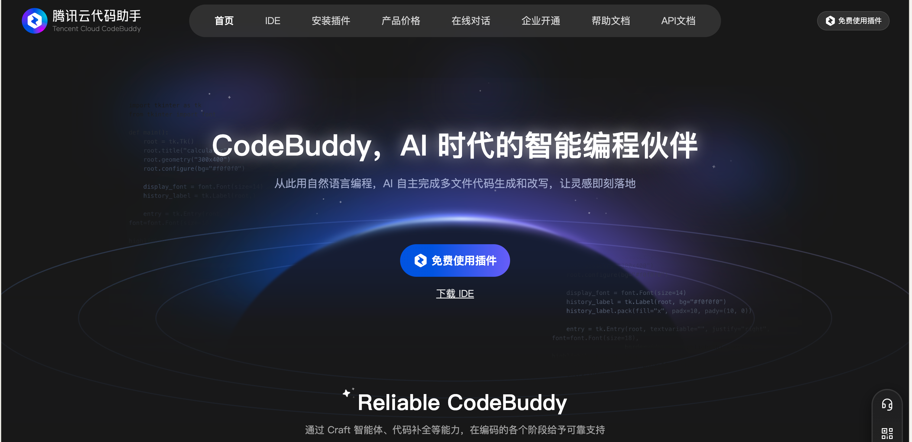
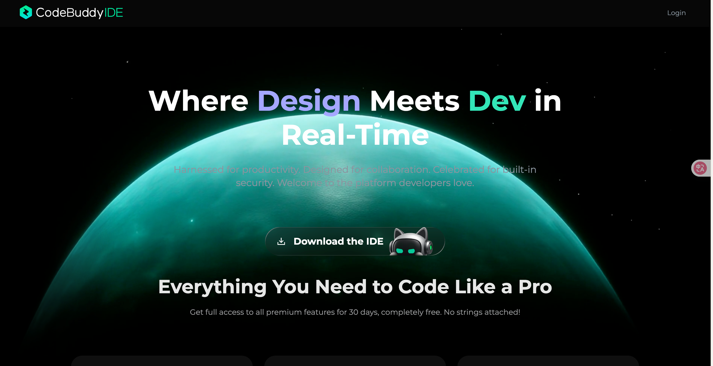
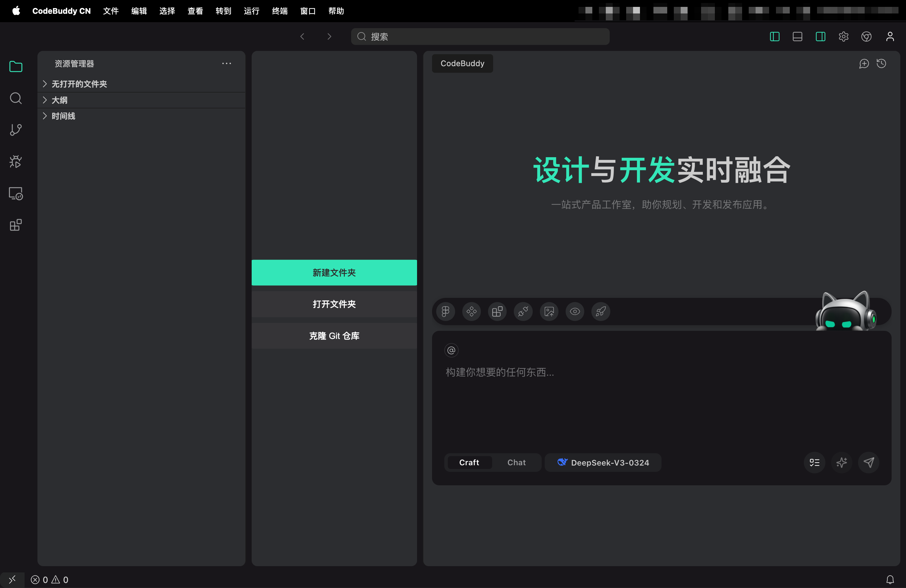
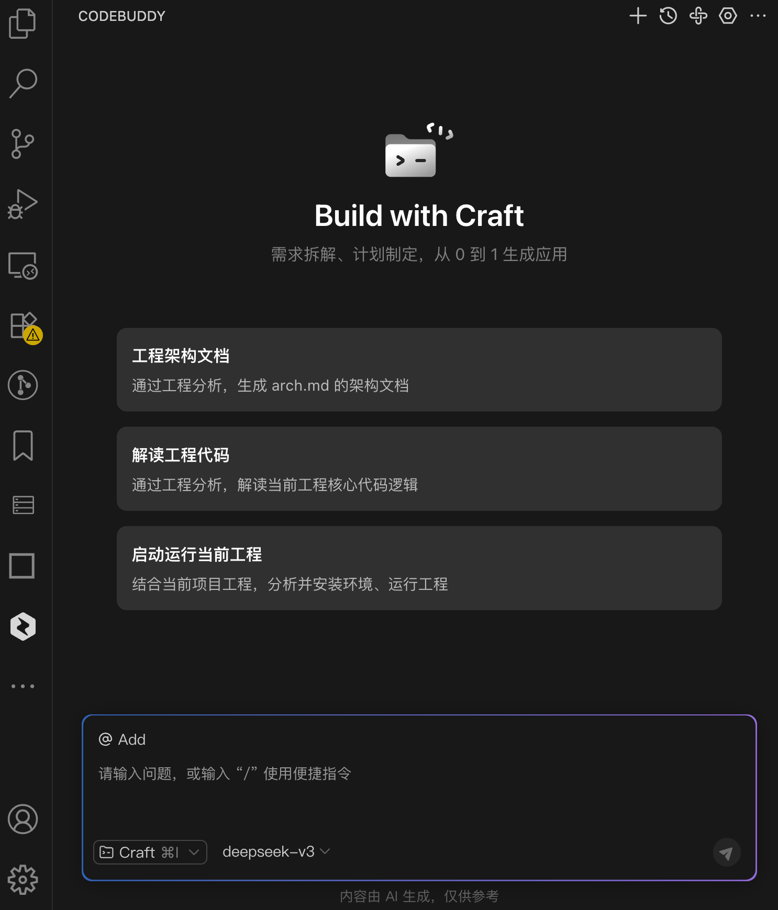
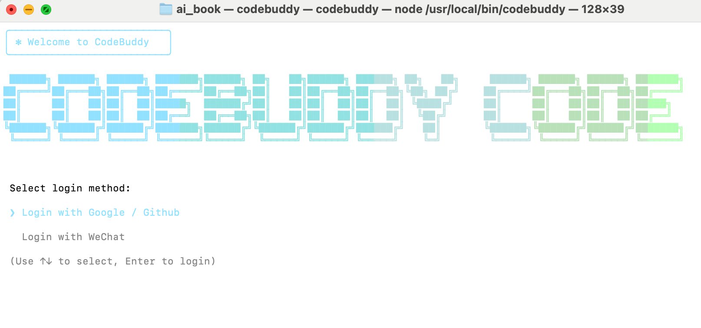
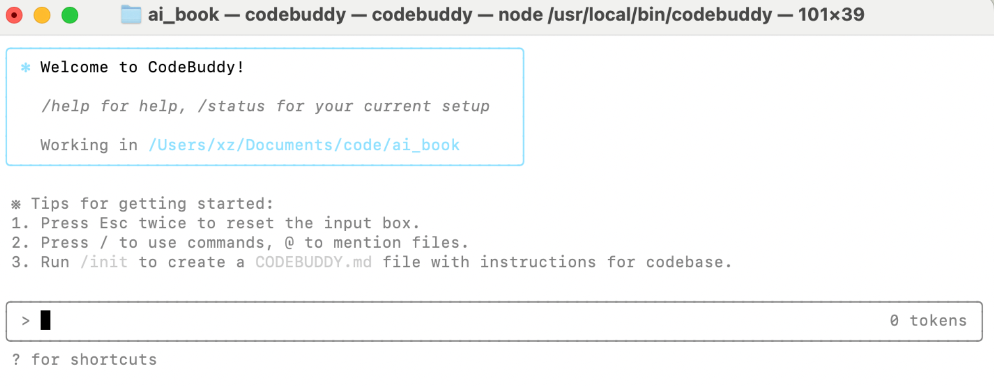

## 3.7 腾讯云 CodeBuddy：AI 一站式工作台

### 3.7.1 CodeBuddy 是什么？

　　CodeBuddy 是腾讯云推出的一个非常聪明的 **AI 编程助手**。可以把它想象成一个能帮助将**想法变成现实**的工具，而无需学习复杂的编程语言。它能帮助将那些听起来很难的编程和设计工作，变得像用普通话聊天一样简单。

### 3.7.2 CodeBuddy 有什么用？

　　对用户来说，CodeBuddy 最厉害的地方在于它能帮助轻松完成以下几件大事：

1.  **把设计图变成真网页**：如果有一张网站的设计图（比如设计师用 Figma 画的），无需懂编程，只要把图给 CodeBuddy，它就能自动帮助把这张图变成一个真的、能用的网页，而且还原度非常高。
2.  **用说话的方式做软件**：无需学习编程，可以直接用大白话告诉 CodeBuddy 想做什么功能，比如“帮我做一个用户注册的页面”。它就能自己理解意思，然后生成所有需要的文件，把这个功能做出来。
3.  **轻松搞定后端**：建网站光有界面不够，还需要一个后端来处理数据。CodeBuddy 内置了腾讯云的一些服务，让用户不需要懂复杂的后端技术，也能轻松搭建数据库和用户登录系统。
4.  **专为中国人优化**：CodeBuddy 是腾讯推出的，它特别懂中国人的需求。比如，它可以直接帮助开发**微信小程序**，而且它对中文的理解和支持也更好。

### 3.7.3 CodeBuddy 的使用方式

　　CodeBuddy 有三种不同的使用方式，可以根据自身习惯来选择：

1. **CodeBuddy IDE（独立软件）**：这是一个完整的软件，下载安装后就能直接使用，适合没有编程经验的产品经理、设计师或编程初学者。它的界面很友好，让用户能用大白话描述需求，然后完成产品的设计、开发和部署。

   **国内版和国际版有什么不同？**

   * **国内版（copilot.tencent.com/ide）**：使用腾讯自研的"混元大模型"和 DeepSeek 模型，特别针对中文和微信小程序开发做了优化。官方截图如图3-7-1所示。
   * **国际版（www.codebuddy.ai）**：支持国外的流行大模型，比如 ChatGPT、Gemini 和 Claude，更适合海外用户或需要使用国际大模型的开发者。官方截图如图3-7-2所示。

   

   图3-7-1 CodeBuddy国内版官方网站截图

   

   

   图3-7-2 CodeBuddy国际版官方网站截图

   

   　　安装完 CodeBuddy 国内版的界面效果如图3-7-3所示。

   

   图3-7-3 CodeBuddy IDE 国内版效果截图

   

2. **CodeBuddy 插件（安装到常用软件）**：如果已经在用一些常用的编程工具（比如 VS Code 或 JetBrains），可以在软件里找到 CodeBuddy 的插件并安装。安装好后，它就会像一个内置的功能一样，随时提供帮助。

   **下载和安装步骤（以 VS Code 插件为例）：**

   1.  打开 VS Code。
   2.  进入"扩展"（Extensions）市场。
   3.  在搜索框中输入"CodeBuddy"。
   4.  找到腾讯云官方发布的 CodeBuddy 插件，单击"安装"。
   5.  安装完成后，在侧边栏找到 CodeBuddy 图标，登录腾讯云账号即可开始使用。

   

   　　在 VS Code 中安装完成后的配图如图3-7-4所示。

   

   图3-7-4 VS Code中安装CodeBuddy插件效果


3. **CodeBuddy Code（命令行工具）**：这是一个面向专业人士的命令行工具，适合对效率有极致要求，习惯用命令行来工作的资深开发者、运维人员等。

**安装前准备**

　　确保系统已安装以下环境：

* **Node.js**：版本 ≥ 18.0
* **npm**：版本 ≥ 8.0（Node.js 安装后通常自带）
* **操作系统**：Windows、macOS 或 Linux

　　可以从 [Node.js 官网](https://nodejs.org/) 下载并安装适合系统的版本。

**安装 CodeBuddy Code CLI**

1.  打开终端（Terminal）：
    * **Windows**：按下 `Win + R`，输入 `cmd`，然后按回车。
    * **macOS**：按下 `Command + 空格`，输入 `终端`，然后按回车。
    * **Linux**：根据发行版，打开终端应用程序。
2.  在终端中输入以下命令进行全局安装：

```bash
npm install -g @tencent-ai/codebuddy-code
```

　　此命令将 CodeBuddy Code CLI 工具安装到系统中，允许在任何目录下使用 `codebuddy` 命令。

**验证安装是否成功**

　　安装完成后，可以通过以下命令验证是否成功安装：

```bash
codebuddy --version
```

　　如果终端返回版本号，说明安装成功。

**启动 CodeBuddy Code CLI**

1.  进入希望存放项目的目录：

```bash
cd your-project-directory
```

2.  启动 CodeBuddy Code CLI：

```bash
codebuddy
```

3.  首次使用时，系统会提示选择登录方式，如图3-7-5所示：
    * **国内用户**：推荐使用微信登录，默认接入 DeepSeek V3 模型。
    * **国际用户**：可选择 Google 或 GitHub 登录，支持 ChatGPT、Gemini 等模型。

　　登录成功后，可以在终端中使用自然语言与 CodeBuddy 进行交互，如图3-7-6所示。例如：

```bash
codebuddy "创建一个支持登录和注册功能的用户管理系统"
```

　　CodeBuddy 将根据描述自动生成项目结构和相应的代码。




图3-7-5 选择登录方式




图3-7-6 CodeBuddy Code CLI 登录成功后的效果


---

### 3.7.4 CodeBuddy 的关键功能和版本区别

　　CodeBuddy 的核心功能都是为了让用户用最简单的方式完成复杂任务。理解下面几个功能，就能更高效地使用它：

1.  **Chat 和 Craft 模式有什么区别？**
    * **Chat 模式（聊天模式）**：就像和智能机器人聊天一样，问它问题，它就回答。比如"这段代码是什么意思？"或者"帮我写一个按钮"。它主要用来回答问题和生成小段代码。
    * **Craft 模式（智能模式）**：这是 CodeBuddy 最厉害的功能。给它一个复杂的任务，比如"把用户注册功能改成用手机号登录"。它会自己思考，然后自动修改好几个相关的文件，把整个大任务完成。它更像一个能自主工作的"智能代理"。
2.  **BoostPrompt 是什么？**
    * **提示词增强器**：给出的指令可能不够详细，BoostPrompt 可以自动帮助优化和完善指令，让 AI 更容易理解真实意图，从而给出更准确的答案。

　　总的来说，CodeBuddy 是一个能帮助将**想法快速落地**的**智能工作台**，让不懂编程的人也能参与到创造和开发的过程中来。