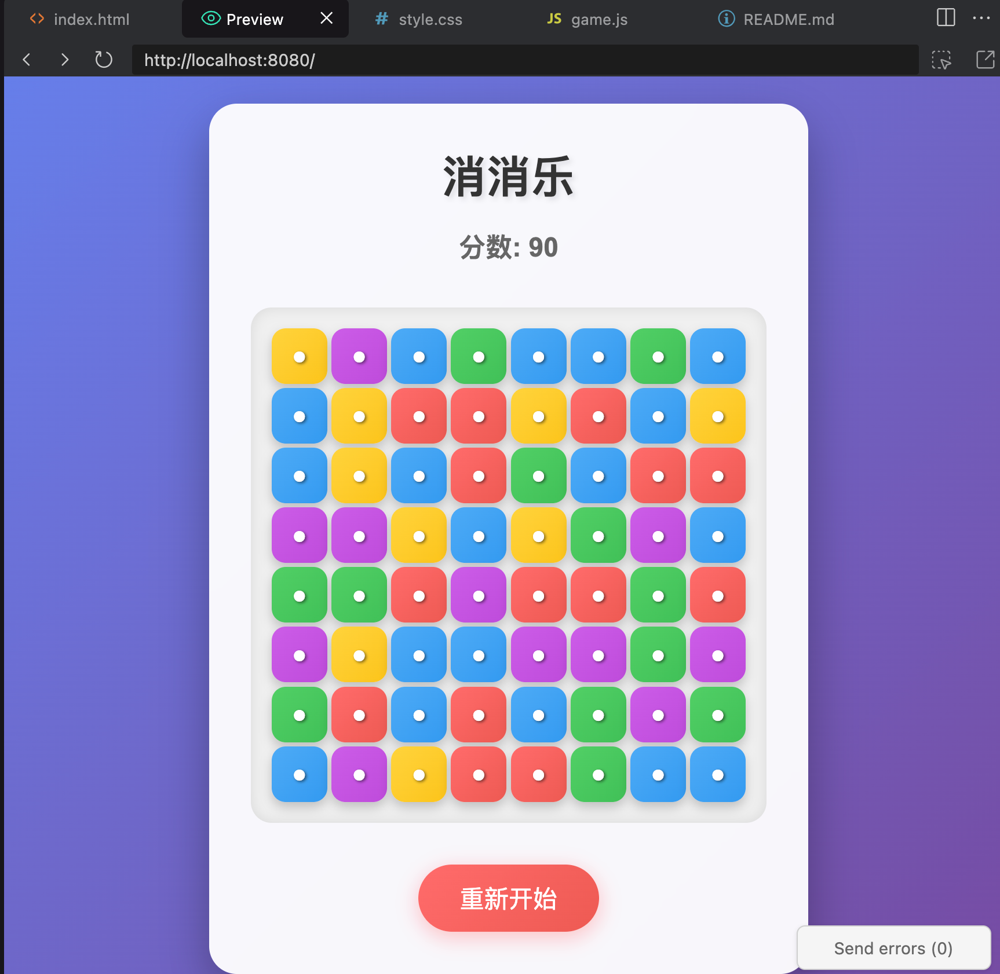
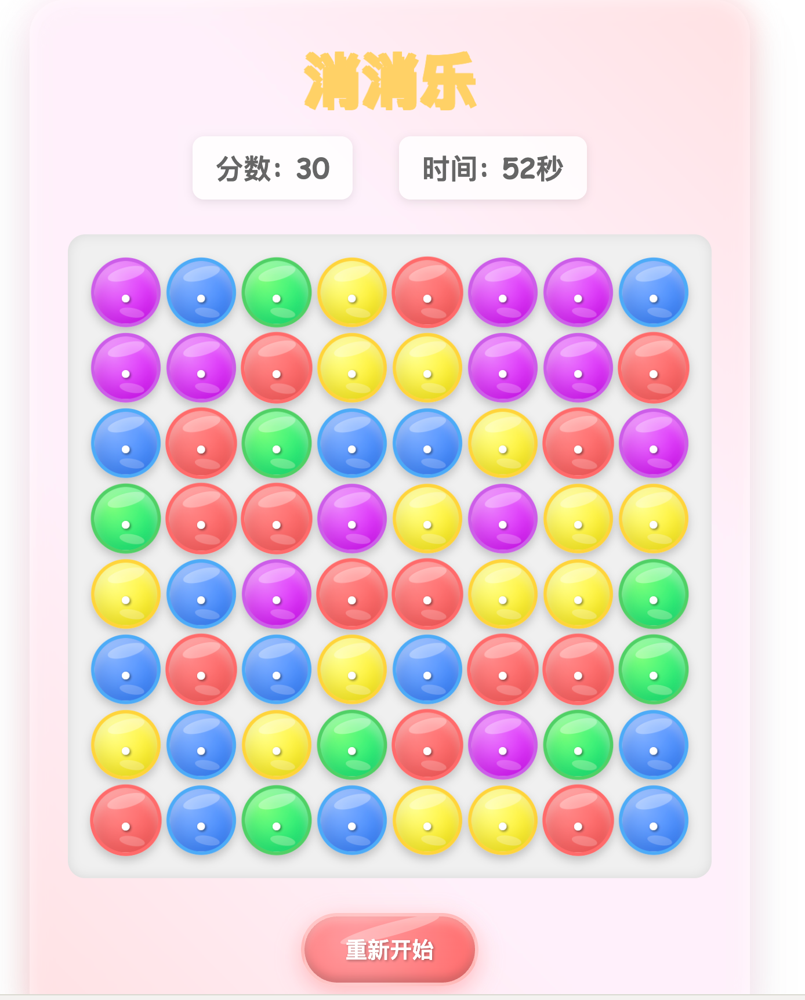
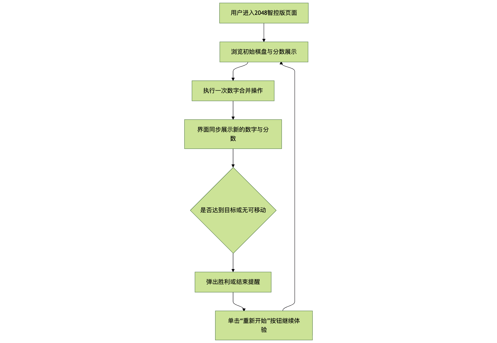
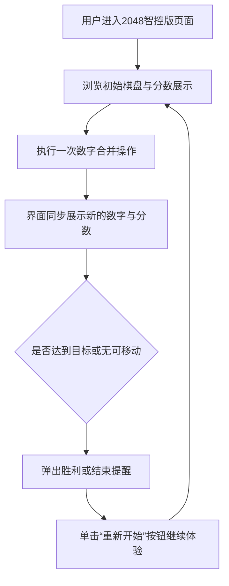
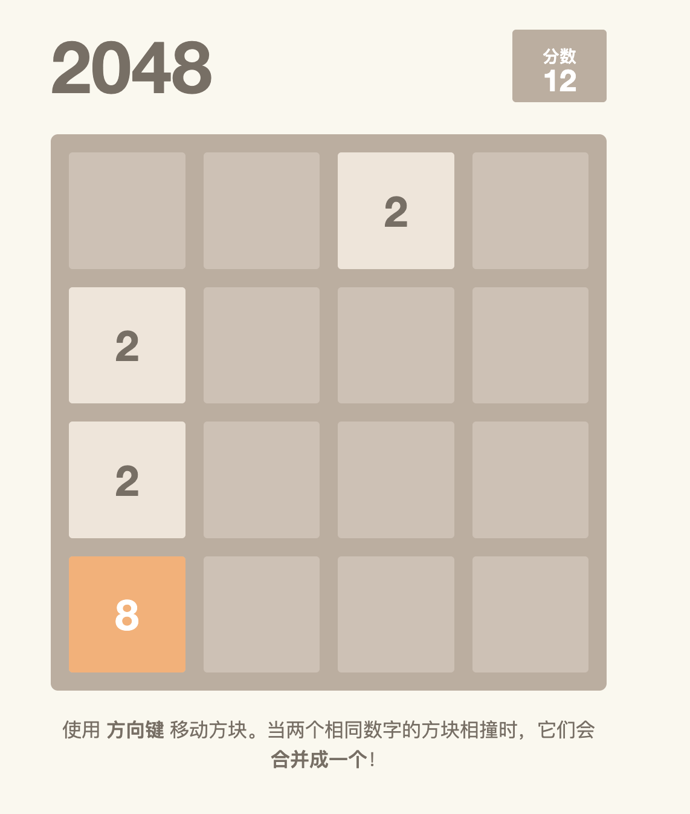

# 5. AI自动化编程实战：AI趣味游戏编程

“游戏的魔力，在于它能把想象变成人人都能参与的现实。”
近期朋友圈里流行的益智小游，常常出自几个灵感闪现的创作者，却能迅速点燃话题。
只要借助AI的聪明助手，就能将脑海中的点子变成亮眼成品，让人们在闲暇片刻感受惊喜与欢乐。

• 想做个轻松上手的小游戏，却总被时间与精力消磨；
• 想把创意分享给朋友，却苦于没有好看的呈现方式；
• 想跟上热门玩法，却难以持续推出新点子；
• 想让作品更有亮点，却担心操作门槛太高。

本节将通过智能消消乐游戏与2048两个案例，带你体验如何借助AI快速搭建受欢迎的小游乐场，让创意即刻变现、娱乐随手可得。


## 5.1 实战篇：指挥AI，三句话打造“智能消消乐”游戏


互动娱乐团队的产品策划师林晓在筹备一场亲子嘉年华活动，计划准备一款既能展示创意又能让家长与孩子轻松互动的小游戏。传统开发流程从需求确认到上线至少需要数周，外包团队也无法及时接洽，项目进度眼看就要延误。

林晓所在的小组缺乏前端工程师，她本人也不擅长编写代码，过去常常因为技术门槛而错失展示机会。为了快速验证玩法并保障活动内容，她尝试将业务设想拆分为结构化需求，交给AI编程处理。

得益于AI编程可以快速生成可用原型，林晓得以在短时间内完成“智能消消乐”的第一版，实现了从创意到演示的高效转换。

### 1. 需求分析与MVP流程

在梳理交互之前，林晓先将玩法节奏拆分为若干关键步骤，让AI能够据此输出贴合实战的原型逻辑。

 “如图5-1-1所示。”


 图5-1-1 需求分析与MVP流程界面

以下流程图梳理了“智能消消乐”MVP的交互路径，从启动游戏到完成计分的全流程，突出玩家与AI生成界面之间的关键触点。

```mermaid
graph TD
    A[玩家单击“开始游戏”按钮] --B[棋盘填充随机彩色方块]
    B --C{玩家拖拽交换相邻方块}
    C --D[生成匹配检测结果]
    D --E{是否形成三消组合}
    E -- 是 --F[方块消除并下落补齐]
    F --G[累计得分并更新分数面板]
    G --H{倒计时是否结束}
    E -- 否 --C
    H -- 否 --C
    H -- 是 --I[展示最终得分并提示重新开始]
```

### 2. 准备阶段

为了建立干净的项目工作区，林晓在桌面创建名为 `my_candy_crush_game` 的文件夹。随后，她在 CodeBuddy 菜单栏选择“文件(File)”→“打开文件夹...(Open Folder...)”，将该文件夹作为工程根目录加载。CodeBuddy 的资源管理器随即聚焦到新建项目，方便后续由AI生成文件。

接下来，林晓确认账号权限，准备在 Craft 模式下与AI协作，以便获取创建文件、执行命令等完整能力。

### 3. 根据需求撰写MVP提示词

林晓首先测试了一句简短指令，验证AI是否理解核心任务。

```markdown
生成一个网页版的消消乐游戏。
```

为了得到更贴合活动场景的版本，她整理出MVP所需的棋盘布局、颜色样式与交互规则，并将其写成结构化提示词，强调评分逻辑与补位机制。

### 4. AI优化提示词

在确认初版可用后，林晓进一步补充动画细节、触控体验与倒计时约束，让AI输出更完整的前端实现方案。她将需求拆分为角色定位、界面要求与交互反馈三部分，确保提示词可以覆盖到动效、音效与可访问性。

优化后的提示词：

```markdown
我想做一个网页版的消消乐游戏，你帮我把它做出来。

它的样子应该是：
1.游戏区域在屏幕正中间，是一个8x8的棋盘。
2.棋盘上要填满五颜六色的方块，比如红、绿、蓝、黄、紫。
3.游戏上方要能显示我的分数。

它的玩法应该是：
1.我可以用鼠标拖动，交换相邻的两个方块。
2.如果有三个或更多同样颜色的方块连成一条直线，它们就会消失。
3.方块消失后，上面的方块会掉下来，顶上会冒出新的方块补上。
4.每消除一次，我的分数就会增加。
```

### 5. 使用CodeBuddy生成应用

在提示词提交后，CodeBuddy 自动创建 `index.html`、`style.css` 与 `script.js` 等文件，并给出生成进度。林晓通过资源管理器核对文件结构，确认AI已完成前端骨架。

```text
my_candy_crush_game/
├── index.html
├── script.js
└── style.css
```


随后，在Craft 模式下，她向AI发送“执行 `启动项目` 命令”的请求，让系统在本地预览环境运行项目。AI 在对话区说明执行状态，并在终端引导预览流程。 启动效果 “如图5-1-2所示。”

```
启动项目
```





图5-1-2 首版“智能消消乐”运行界面


为了增强玩法节奏，她继续与AI对话，请求在界面中加入60秒倒计时与结束结算弹窗。AI 在响应中列出了新增的JS逻辑与UI变更。

提示词：

```
给游戏加个60秒的倒计时吧，时间到了就结束，告诉我得了多少分。
并且修改棋盘改为圆角糖果风格，并统一背景色调。
```


最后，林晓让AI调整视觉主题。AI 提供新的CSS样式，使整体画面更贴合嘉年华活动氛围。

“如图5-1-3所示。”





图5-1-3 圆角糖果主题的最终界面


### 6. 举一反三：延展应用场景

- **限时闯关版消消乐**：基于倒计时机制拓展为多关卡模式，引入不同棋盘尺寸与障碍物，提高活动现场的挑战性。  
- **主题化教育小游戏**：将彩色方块替换为学科元素（字母、拼音、数字），结合语音提示，服务双语教学或科普展览。  
- **活动积分兑换平台**：将得分与活动积分系统联动，实现扫码登录、成绩上传与奖品兑换，形成完整的运营闭环。  
- **多端实时竞赛模式**：对接WebSocket服务，允许多位参与者实时比拼得分，提升线下活动的互动氛围。


## 5.2 实战篇：指挥AI，升级打造“2048智控版”

产品经理林岚近期负责一款线上活动的互动模块，传统做法需要开发团队手写 2048 小游戏并反复调试，周期过长。为了缩短上线时间，她计划利用 CodeBuddy 驱动 AI 自动生成可运行的“2048 智控版”。林岚最终决定尝试以最简提示撬动完整项目，让 AI 负责扩写需求、生成代码并在迭代中持续修正视觉问题。

### 1. 需求分析与MVP流程

如图5-2-1所示。



图5-2-1 需求分析与MVP流程界面

整体流程从用户进入页面、触发开始动作，再到方块生成、分数累加、判定胜负。关键节点包括键盘与手势监听、撤销栈管理、失败弹窗引导继续挑战等。


 ### 2. 准备阶段
林岚在桌面创建 `my_2048_master` 项目文件夹，并通过 CodeBuddy 执行“选择 File -> Open Folder…”命令加载该目录，让对话框保持 Craft 模式。

### 3. 根据需求撰写MVP提示词

林岚以最小指令启动项目构思，在 CodeBuddy 对话框输入基础需求

```text
帮我开发网页版的2048小游戏
```

### 4. AI优化提示词

CodeBuddy 根据基础指令自动强化提示词，兼顾交互逻辑与视觉布局。优化结果如下：

```text
开发一个网页版的2048数字合并游戏，使用HTML、CSS和JavaScript实现。
要求包含以下功能：4x4的游戏棋盘，通过键盘方向键控制数字方块的移动，相同数字合并时分数累加，游戏结束时显示最终得分。
界面设计要简洁美观，包含重新开始按钮，并确保在不同设备上都能正常显示和操作。
游戏逻辑需完整实现数字生成、移动合并规则和胜负判定。
```


这段提示词明确了技术栈、输入控制方式、胜负判定与自适应要求，为 AI 生成代码提供了充足约束。林岚确认后提交给 CodeBuddy 生成初版项目。

### 5. 使用CodeBuddy生成应用

CodeBuddy 依据提示词自动创建 HTML、CSS 与 JavaScript 文件，如下面的目录结构所示

```
my_2048_master/
├── index.html
├── script.js
└── style.css
```

生成完成后，输入以下提示词，启动项目预览：

```text
启动项目
```

CodeBuddy 启动本地预览后，初版界面在桌面浏览器加载完毕。测试过程中，她发现数字方块与棋盘线条错位，为快速修复，她在对话框追加提示词：

```text
数字和棋盘没有对齐，请重新调整排版
```

该补充提示词明确指出布局异常，AI 随即更新 CSS 样式并重新部署页面。

修复后的界面如图5-2-2所示，数字方块与网格严丝合缝，分数面板与操作按钮同样自动响应窗口尺寸变化。



图5-2-2 修复后的界面效果

### 6. 举一反三：延展应用场景

2048 智控版的构建流程展示了如何将最小提示扩展为完整应用，同样思路可以迁移至多类交互式项目：
- **自适应棋盘训练系统**：通过调整规则与计分逻辑，辅助数学课堂快速搭建练习工具。  
- **活动页小游戏中台**：将模板化提示词沉淀为模块库，为市场活动按需生成不同风格的互动游戏。  
- **手势驱动数据看板**：复用手势控制与撤销机制，打造支持滑动切换的实时运营面板。  
- **AI 辅助教程沙盘**：结合撤销机制与提示，每步操作附带说明，供培训场景实时演示。  


## 5.3 本章⼩结

通过“智能消消乐”与“2048智控版”两个案例，本章完整演示了如何以活动实战为驱动，让AI承担从需求澄清、提示词优化到代码生成与预览调试的全链路工作。借助结构化的提示词与迭代式对话，开发者能够快速扩充玩法、完善视觉表现，并在最短时间内拿到可运行的前端原型。

我们还总结了延展思路，展示同一套生成流程如何迁移到教育训练、营销活动、实时竞赛等多元场景，帮助团队在不同业态中复制成功经验。只要保持需求拆解、提示词强化、自动部署的节奏，AI驱动的趣味游戏开发即可持续产出具备商业价值的互动体验。
