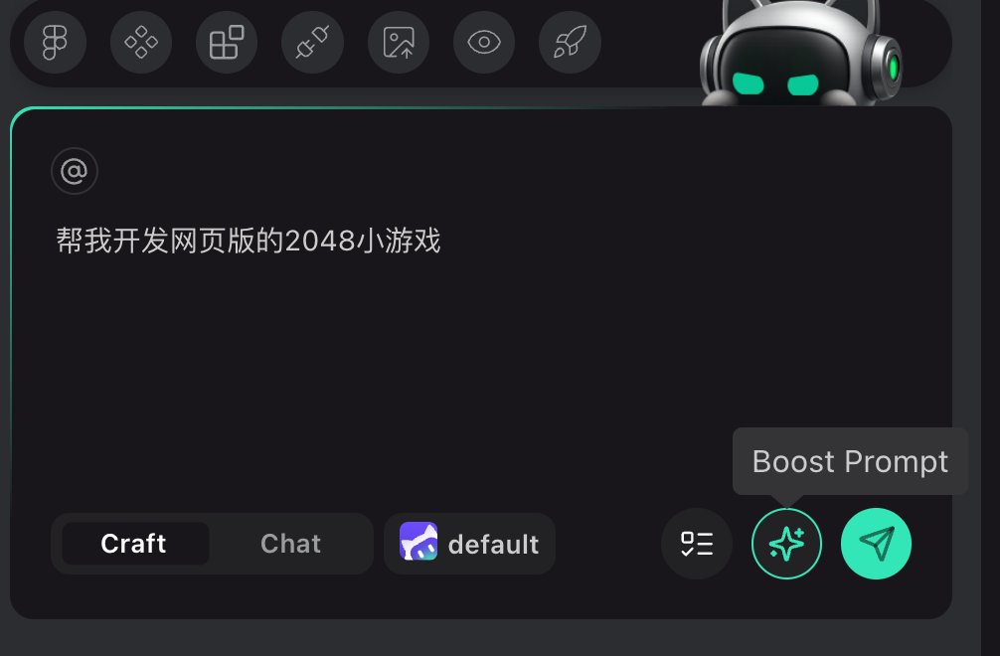
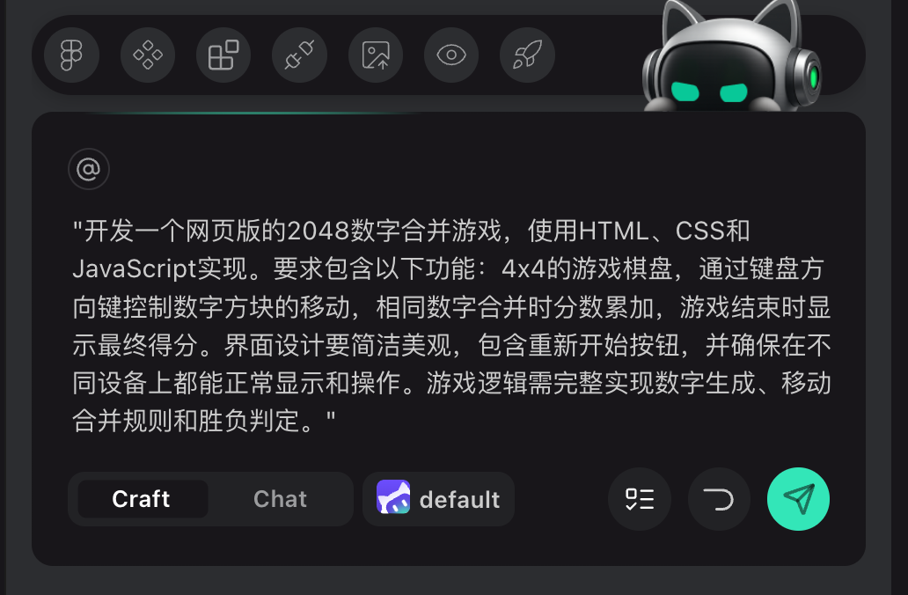
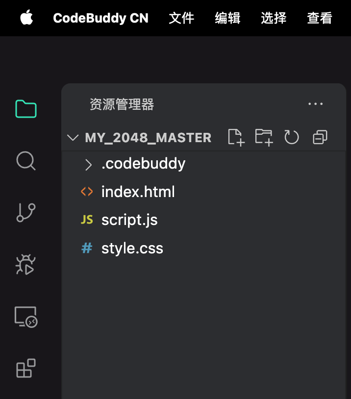
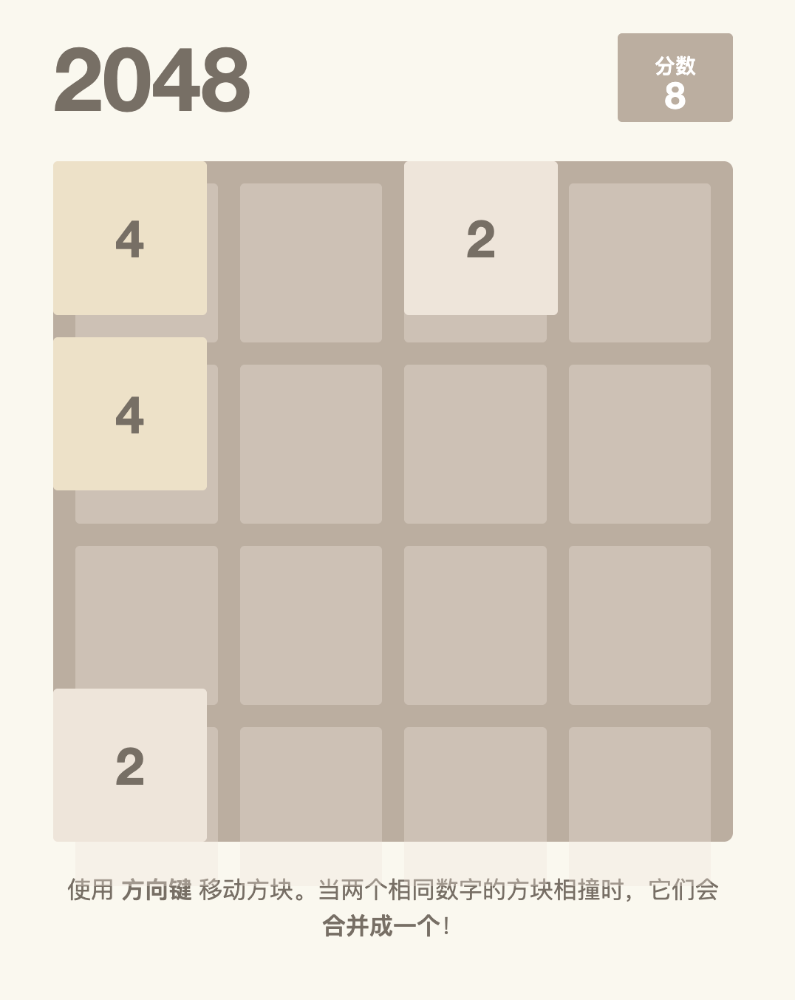
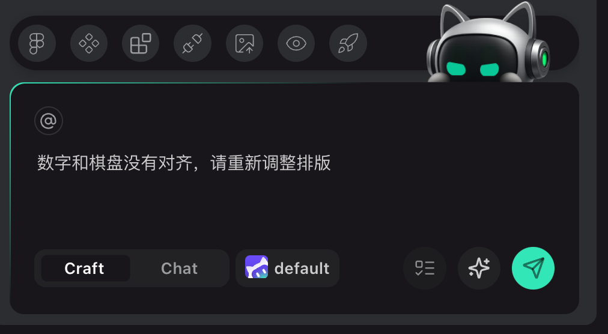

## 05.2  **实战篇：指挥AI，升级打造你的“2048智控版”**

欢迎回到实战环节！在上一章里，我们用三句话就完成了“智能消消乐”。这次换成同样家喻户晓的 2048：玩家通过滑动把相同数字合并成更大的数，目标是拼出 2048，因此大家一看就能上手体验结果。

本章的重点不是介绍新规则，而是进阶你的“AI导演”能力——如何用最少的初始提示，让 CodeBuddy 帮你自动补全细节，再利用生成的代码快速调试到满意为止。我们会围绕三件事来展开：

- 从一句“帮我开发网页版的2048小游戏”起步，演示 Boost Prompt 如何把模糊需求扩写成靠谱的开发说明；
- 在扩写提示词里植入你真正关心的体验，比如分数展示、手势操作、撤销和棋盘尺寸切换；
- 项目跑起来后，对照实际效果查缺补漏，动手反馈 bug 并让 AI 协助修复。

准备好了吗？跟着步骤走，你会发现“少说多做”同样能驱动一个完整的游戏项目。

### **第一步：搭建项目工作区——继续保持专业习惯**

1. 在桌面或任何你喜欢的位置，新建一个全英文、下划线连接的文件夹，比如：`my_2048_master`。
2. 打开CodeBuddy，依次点击 `File -> Open Folder…`，选择这个文件夹。
3. 确认CodeBuddy已经加载项目，聊天框处于 Craft 模式。

保持和上一章一样的节奏，只不过这次我们会先用一个极简提示开局，再通过 CodeBuddy 的 Boost Prompt 功能，把模糊想法变成一份专业需求。

### **第二步：下达专业指令——告诉AI每个细节**

先在聊天框里输入一句非常简单的指令，例如：“帮我开发网页版的2048小游戏” （如图 05-2-1 所示）。发送后，点击 CodeBuddy 里出现的 **Boost Prompt** 按钮，让它帮你润色并补充细节。你可以继续补充自己想要的特色，得到的提示词大致如下（如图 05-2-2 所示） ：

```text
开发一个网页版的2048数字合并游戏，使用HTML、CSS和JavaScript实现。要求包含以下功能：4x4的游戏棋盘，通过键盘方向键控制数字方块的移动，相同数字合并时分数累加，游戏结束时显示最终得分。界面设计要简洁美观，包含重新开始按钮，并确保在不同设备上都能正常显示和操作。游戏逻辑需完整实现数字生成、移动合并规则和胜负判定
```

发送完成后，静待CodeBuddy为你生成文件结构。最后的代码结构如图图 05-2-3 所示



图05-2-1 在对话框中输入最简单的提示词




图 05-2-2  AI自动优化后的提示词




图 05-2-3 生成的代码文件夹目录结构 


### **第三步：启动项目——边跑边调试**

与上一章相同，在聊天框里输入 `启动项目` 即可。CodeBuddy会自动挑选合适的方式预览项目。第一次跑起来时，像玩家一样多动手：

- 试试方向键或滑动手势，确认方块移动、合并、计分都正常；
- 注意画面细节，比如分数面板的位置、动画节奏、数字是否贴合格子；
- 体验撤销按钮和棋盘尺寸切换，看看是否如你设想。

如果遇到问题，直接把现象告诉AI，让它继续打磨。举个例子：我第一次测试时发现“数字和棋盘没有对齐”，于是补充了一句“数字和棋盘没有对齐，请重新调整排版”，如图 05-2-4所示 ，AI就马上给出了修复方案。记住，绝大多数项目都需要经过几轮检查与微调，耐心描述你看到的不对劲之处，就能一步一步把项目磨到满意为止。



图 05-2-4  游戏界面没对齐，样式有错误




图 05-2-5 指出代码错误，让AI修改


图 05-2-6 修复后的界面效果


### **本章小结**

相比上一章的消消乐，这次我们先用一句“帮我开发网页版的2048小游戏”开局，再借助 Boost Prompt 把需求打磨成“导演级”指令。你只需要把真正想要的体验说清楚——键盘和滑动要怎么操作、分数怎么展示、有没有撤销和自动行动入口——AI就能把它们统统实现。继续保持这种节奏，往后的创意都会越来越容易落地。
