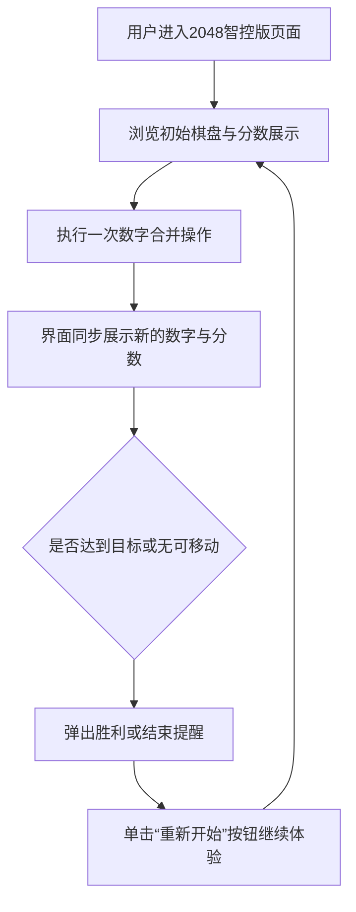

## 05.2 实战篇：指挥AI，升级打造“2048智控版”

产品经理林岚近期负责一款线上活动的互动模块，传统做法需要开发团队手写 2048 小游戏并反复调试，周期过长。为了缩短上线时间，她计划利用 CodeBuddy 驱动 AI 自动生成可运行的“2048 智控版”。林岚最终决定尝试以最简提示撬动完整项目，让 AI 负责扩写需求、生成代码并在迭代中持续修正视觉问题。

### 1. 需求分析与MVP流程

如图5-2-1所示。


图5-2-1 需求分析与MVP流程界面

整体流程从用户进入页面、触发开始动作，再到方块生成、分数累加、判定胜负。关键节点包括键盘与手势监听、撤销栈管理、失败弹窗引导继续挑战等。


 ### 2. 准备阶段
林岚在桌面创建 `my_2048_master` 项目文件夹，并通过 CodeBuddy 执行“选择 File -> Open Folder…”命令加载该目录，让对话框保持 Craft 模式。

### 3. 根据需求撰写MVP提示词

林岚以最小指令启动项目构思，在 CodeBuddy 对话框输入基础需求

```text
帮我开发网页版的2048小游戏
```

### 4. AI优化提示词

CodeBuddy 根据基础指令自动强化提示词，兼顾交互逻辑与视觉布局。优化结果如下：

```text
开发一个网页版的2048数字合并游戏，使用HTML、CSS和JavaScript实现。
要求包含以下功能：4x4的游戏棋盘，通过键盘方向键控制数字方块的移动，相同数字合并时分数累加，游戏结束时显示最终得分。
界面设计要简洁美观，包含重新开始按钮，并确保在不同设备上都能正常显示和操作。
游戏逻辑需完整实现数字生成、移动合并规则和胜负判定。
```


这段提示词明确了技术栈、输入控制方式、胜负判定与自适应要求，为 AI 生成代码提供了充足约束。林岚确认后提交给 CodeBuddy 生成初版项目。

### 5. 使用CodeBuddy生成应用

CodeBuddy 依据提示词自动创建 HTML、CSS 与 JavaScript 文件，如下面的目录结构所示

```
my_2048_master/
├── index.html
├── script.js
└── style.css
```

生成完成后，输入以下提示词，启动项目预览：

```text
启动项目
```

CodeBuddy 启动本地预览后，初版界面在桌面浏览器加载完毕。测试过程中，她发现数字方块与棋盘线条错位，为快速修复，她在对话框追加提示词：

```text
数字和棋盘没有对齐，请重新调整排版
```

该补充提示词明确指出布局异常，AI 随即更新 CSS 样式并重新部署页面。

修复后的界面如图5-2-2所示，数字方块与网格严丝合缝，分数面板与操作按钮同样自动响应窗口尺寸变化。


图5-2-2 修复后的界面效果

### 6. 举一反三：延展应用场景

2048 智控版的构建流程展示了如何将最小提示扩展为完整应用，同样思路可以迁移至多类交互式项目：
- **自适应棋盘训练系统**：通过调整规则与计分逻辑，辅助数学课堂快速搭建练习工具。  
- **活动页小游戏中台**：将模板化提示词沉淀为模块库，为市场活动按需生成不同风格的互动游戏。  
- **手势驱动数据看板**：复用手势控制与撤销机制，打造支持滑动切换的实时运营面板。  
- **AI 辅助教程沙盘**：结合撤销机制与提示，每步操作附带说明，供培训场景实时演示。  
