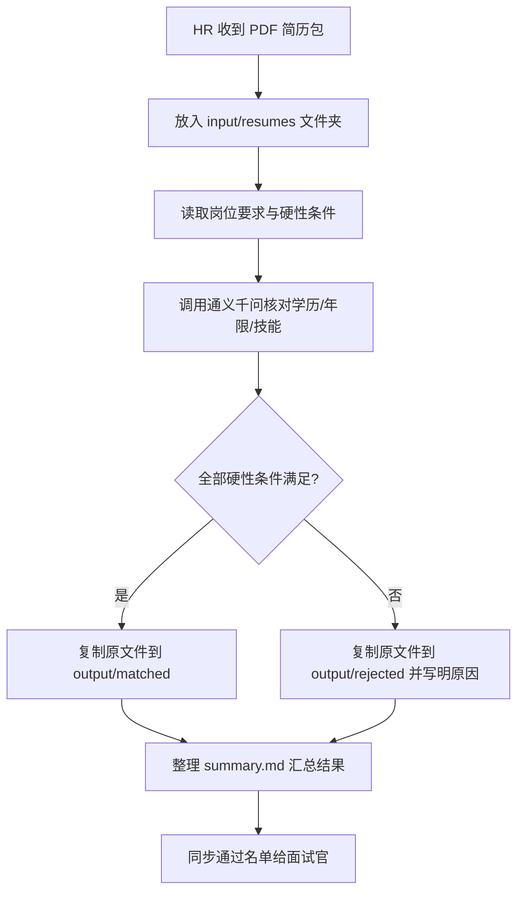

##  8.1  简历智能筛选与分析

### 场景痛点

每到招聘旺季，HR 手头总有几十甚至上百份 PDF 简历要翻阅，记忆候选人亮点、核对技能年限、同步面试官意见，一天下来腰酸背痛还难免漏掉好苗子。常见的 Excel 筛选或人工标记方式既慢又容易出错，一旦招聘需求突增，就会错过最佳候选人。


### 本章核心知识点

1. 批量读取并解析本地 PDF 文件

2. 用 Codex 规划 Node.js 自动化脚本
3. 本地运行大语言模型并迭代提示词

### 准备工作

1. 申请模型密钥：打开阿里云百炼控制台，创建通义千问的 API Key，复制保存好（先放在备忘录或便签里即可）。
3. 创建项目文件夹：在桌面或任意位置新建 `Resume-Filter` 文件夹，并用 VS Code 打开它。其余代码文件稍后交给 Codex 自动生成。
4. 准备输入资料：
   - 在 `Resume-Filter` 中新建 `input` 文件夹，并在其中创建 `resumes` 子文件夹，用来放待筛选的 PDF 简历。
   - 在 `input` 下新建 `job_requirements.md`，把岗位的硬性要求（学历、年限、必须掌握的技能等）用自然语言写进去。Codex 会根据这份描述去筛选候选人。比如要求如下：

```
岗位名称：前端开发专家  
学历要求：本科及以上  
工作经验：前端方向 3 年及以上  
关键技能：熟练掌握 React 

补充说明：负责企业协同产品，优先考虑有大型项目经验的候选人。
```

4. 留意 API Key：后续脚本运行时会提示你粘贴密钥，并自动生成 `.env` 和其他配置文件，无需手动创建。

### 梳理业务流程

先把“文件从哪里来、如何到达筛选结果”画成流程图，如图8.1.1所示



图8.1.1 业务流程图


### 从口述需求到结构化提示词

#### 步骤 1：撰写详细的提示词

把需求拆成模块，让 Codex 听懂“手里有什么资料”“要做哪些事”“最后想看到什么结果”。

```text
你是我的技术搭档，熟悉 Node.js 和通义千问。我现在要把一叠 PDF 简历自动筛一遍。

我已经准备好：
- 岗位说明写在 input/job_requirements.md。
- 所有简历放在 input/resumes 这个文件夹。
- 接口怎么调用可以看 docs/tongyi-qwen-api.md。

请你帮我做下面这些事：
1. 挨个读取 PDF，如果读不出文字，就在结果里备注“Need manual check”然后继续下一份。
2. 对照岗位里的硬性条件（学历、年限、关键技能），只要有一项不符合，就判定为不通过。
3. 通过的简历原文件复制到 output/matched，不通过的放到 output/rejected；这些文件夹如果不存在请自动创建。
4. 把最终结果写成 summary.md，告诉我：
   - 总共处理了多少份
   - 哪些人通过（简单写明命中了哪些条件）
   - 哪些人没通过（写明缺哪一项）
5. 脚本运行结束后，在终端打印完成状态。

注意：
- 调接口失败就稍等再试，最多重试两次。
- 如果发现缺 .env 或配置文件，请顺手生成一个模板提醒我填。
```


阿里云通义千问模型说明文档  tongyi-qwen-api.md

获得通义千问模型的api文档获取的方法，请参考之前的章节

````
# 通义千问AI模型调用api文档说明

# 请求接口：
```
curl --location "https://dashscope.aliyuncs.com/api/v1/services/aigc/text-generation/generation" \
--header "Authorization: Bearer $DASHSCOPE_API_KEY" \
--header "Content-Type: application/json" \
--data '{
    "model": "qwen-plus",
    "input":{
        "messages":[      
            {
                "role": "system",
                "content": "You are a helpful assistant."
            },
            {
                "role": "user",
                "content": "你是谁？"
            }
        ]
    },
    "parameters": {
        "result_format": "message"
    }
}'
```

# 出参

```

{
    "choices": [
        {
            "message": {
                "role": "assistant",
                "content": "我是通义千问，由阿里云研发的超大规模语言模型。我能够回答问题、创作文字，如写故事、公文、邮件、剧本等，还能进行逻辑推理、编程，甚至表达观点和玩游戏。我支持多种语言，包括中文、英文、德语、法语、西班牙语等。如果你有任何问题或需要帮助，欢迎随时告诉我！"
            },
            "finish_reason": "stop",
            "index": 0,
            "logprobs": null
        }
    ],
    "object": "chat.completion",
    "usage": {
        "prompt_tokens": 22,
        "completion_tokens": 80,
        "total_tokens": 102,
        "prompt_tokens_details": {
            "cached_tokens": 0
        }
    },
    "created": 1760665740,
    "system_fingerprint": null,
    "model": "qwen-plus",
    "id": "chatcmpl-71c8620d-d134-454c-b462-d1d4dda8d56d"
}

```

````


#### 步骤 2： Codex 生成代码

使用codex 发送上面的提示词，代码生成完成后，提示我们输入通义千问的模型密钥，如图8.1.2。按照要求，拷贝 .env.example 文件，并粘贴密钥。生


图 8.1.2 提示我们写入api密钥


拷贝通义千问变量进去：

```
TONGYI_API_KEY=sk-11faff6c49a7436b9a6a0431c886a84c
```


#### 步骤3： 运行代码测试

可以直接在vscode中的输入“运行项目”，AI就会主动安装依赖和执行程序。
或者在命令行输入命令：“npm run filter”，如图8.1.3所示。执行完成后会提示执行了多少个文件，有多少个简历符合要求，有哪些不符合及原因，如图8.1.4所示。最后会在项目目录中新建一个output的文件夹，里面会分类出符合和不符合要求的简历，如图8.1.5所示。


如图8.1.3所示 命令行输入指令


如图8.1.4所示 命令行执行之后的效果


如图8.1.5所示 生成的总结文档


### 延伸场景

- **合同归档**：把 PDF 合同自动分类至“已签署”“待盖章”文件夹，输出风险提示。
- **活动报名简历**：对报名表里自我介绍进行关键词打分，生成面试排期建议。
- **售后案例分析**：把客服处理记录 PDF 整理成 FAQ，与工单系统联动。

> 同一个提示词框架可以迁移到“只要有文档、就能自动评估”的场景。调整输入目录和评分标准，就能快速复制成果。

### 总结与行动

- Codex 能承担“解析 PDF + 调用大模型 + 生成报告”的流水线，HR 只需在关键节点做判断。
- 提示词是项目的“项目说明书”，请持续记录版本、补充验收标准。
- 现在就挑选 5 份真实简历制作试验集，按照本章步骤跑通脚本，并把输出交给团队评审。完成一次闭环后，你就拥有一个可复制的 AI 智能筛选模板。
