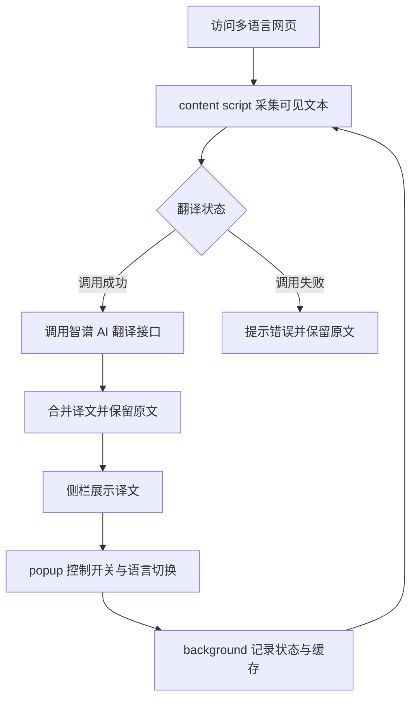
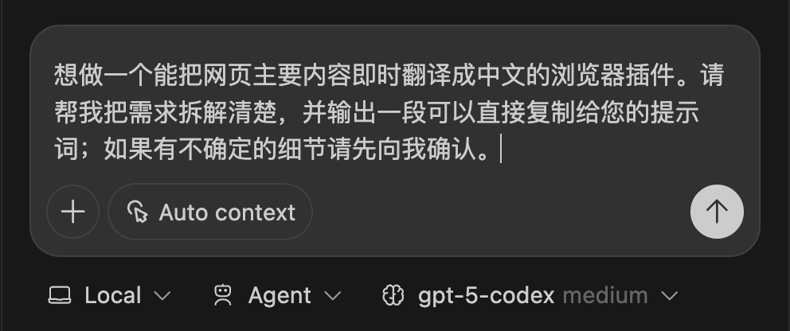
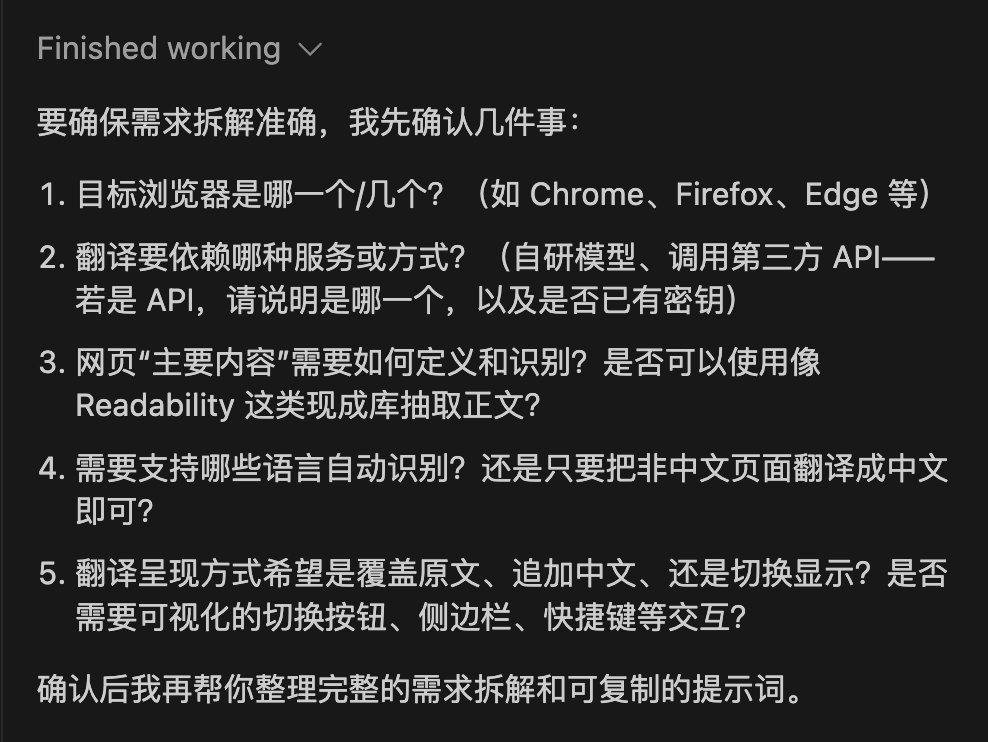
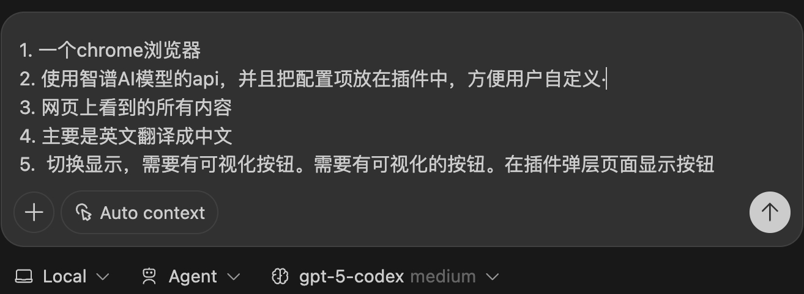
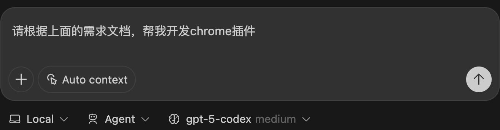
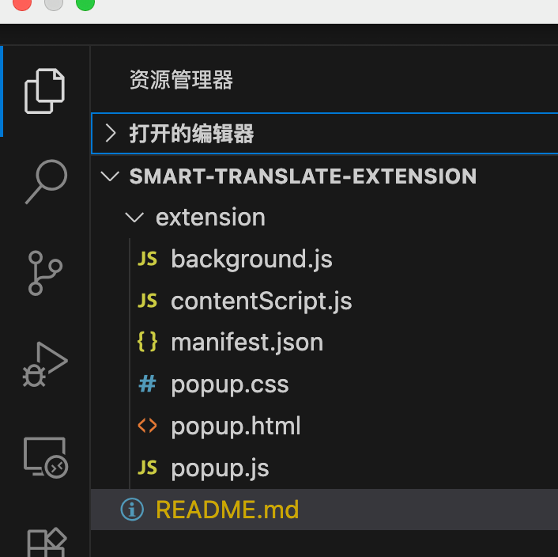
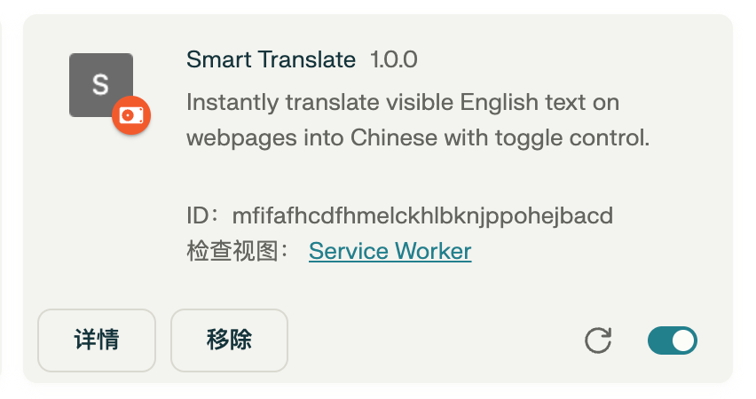
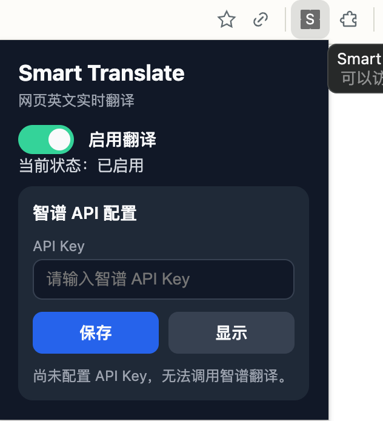
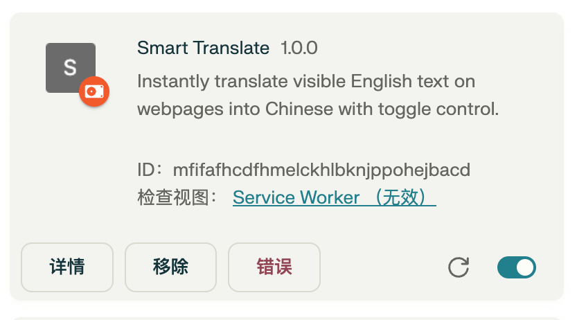

### 10.2.2 智能翻译网页扩展

跨境内容运营部门负责人周宁负责维护多语言的产品落地页。团队需要在新品发布当日同步英文、德文、日文版本，但人工翻译总是滞后，导致海外用户看到的仍是旧文案，投诉逐渐增多。周宁尝试复制粘贴到在线翻译工具，却必须一段段对照，比人工翻译更耗时。

周宁决定引入以 Codex 为核心的浏览器扩展，让翻译流程在访问网页时自动触发。当场景、角色、接口隔离好之后，只要 AI 按剧本生成代码就能上线。然而，如何把需求说清、如何让扩展在复杂页面保持稳定，是摆在周宁面前的关键问题。

#### 需求分析与MVP流程
> 如图10-20所示。
> 
> （此处插图占位）
> 
> 图10-20 需求分析与MVP流程界面

周宁将 MVP 目标锁定为“自动翻译可见内容并允许原文切换”，并将团队成员分工到插件的 popup、content script、background service worker 与侧栏 UI。围绕这些角色，他归纳出以下重点：

- 拆分扩展结构，明确脚本与界面的消息流向。
- 将自然语言需求转译成 Codex 可执行的提示词。
- 接入智谱 AI 翻译接口，兼顾异常处理与性能。

为便于沟通，周宁绘制了业务流程图，帮助团队和 AI 保持相同视角。



说明：
- 该图展示业务层面的用户与 AI 交互路径。
- “content script”“popup”等名称保持与 Manifest V3 一致，便于后续核对。
- 节点用中文描述操作动作，确保出版风格统一。

#### 准备阶段

在正式编写提示词前，周宁先完成本地环境准备，保证后续对话生成的代码可以直接落地。

- 打开 `chrome://extensions` 并开启右上角的“开发者模式”，为加载未打包扩展做铺垫。
- 安装最新版 VS Code，并在扩展市场搜索“OpenAI Codex”完成登录配置，以便在侧栏直接对话生成代码。
- 在桌面创建 `smart-translate-extension` 目录，用 VS Code 打开该目录，确认 Codex 面板已经连接成功。
- 准备好智谱 AI 的 API Key，后续将写入 `.env` 或 popup 配置界面。

#### 根据需求撰写MVP提示词

周宁先用自然语言描述痛点，让 Codex 主动追问隐含需求，并借助连续对话补齐遗漏的信息。

> 如图10-21所示。



图10-21 Codex 追问翻译扩展的目标受众


> 如图10-22所示。



图10-22 进一步限定需要支持的页面类型


> 如图10-23所示。



图10-23 Codex 基于补充信息输出结构化需求


最初的提问直接指向“需求拆解”这一任务，使 Codex 进入分析模式。

```markdown
想做一个能把网页主要内容即时翻译成中文的浏览器插件。请帮我把需求拆解清楚，并输出一段可以直接复制给您的提示词；如果有不确定的细节请先向我确认。
```

根据多轮对话整理出的 MVP 提示词如下，保留了原项目的全部约束条件。

```markdown
请基于以下需求编写一个 Chrome 浏览器扩展：

1. 自动扫描与翻译：在用户访问任意网页时，content script 自动扫描可见的英文文本节点，调用智谱 AI 模型 API 将其翻译成中文。
2. 内容处理：
   - 仅翻译用户可见内容，忽略脚本、样式、隐藏元素等非展示文本；
   - 对动态加载的内容也应生效（可使用 MutationObserver）。
3. 页面展示：保留原页面结构，翻译后默认展示中文，同时保存原文以便恢复，支持原文/译文切换。
4. 功能控制：在扩展的 popup 页面添加一个按钮或开关，允许用户启用或禁用翻译功能，并显示当前状态。
5. 配置项：将智谱 AI 的 API Key 作为插件配置项，在 popup 页面中提供配置和保存功能。
6. 技术与性能：
   - 使用 Manifest V3；
   - 组织代码为 background service worker、content script、popup UI，并提供清晰的模块划分；
   - 处理调用失败或网络异常时的错误提示，避免页面卡顿；
   - 可考虑简单的缓存策略减少重复请求。
7. 交付物：请给出完整的项目文件结构及源码，并说明如何在本地加载调试该扩展。
```

#### AI优化提示词

在得到基础提示词后，周宁进一步强调状态同步、错误分级与多语种扩展能力，使 Codex 输出的代码更易于迭代。优化后的提示词以分段结构呈现，明确每个模块的职责、API 约束和交互反馈。

```markdown
角色：浏览器扩展开发顾问  
目标：生成符合 Manifest V3 的智能网页翻译扩展源码。  
输入：用户提供的网页语言、目标语言偏好，以及智谱 AI 的 API Key。  
功能要求：  
1. content script 仅处理可见节点，并通过 MutationObserver 监听新增内容；  
2. background service worker 统一管理 API 调用、缓存策略与速率限制；  
3. popup 页面提供启停开关、语言切换、API Key 存储以及状态提示；  
4. 侧栏或悬浮面板展示翻译结果并支持原文切换；  
5. 对网络异常、未配置密钥、返回空值等场景分级提示。  
输出：  
- 完整目录结构（manifest、脚本、样式、配置文件）；  
- 关键函数附带注释说明职责和调用顺序；  
- 提供本地加载与调试步骤，并在最后列出可扩展的多语种策略。
```

#### 使用CodeBuddy生成应用

周宁将提示词粘贴到 Codex 面板，请求直接生成项目代码。命令式提示在对话上下文中建立工作模式。

```markdown
请根据上面的需求文档，帮我开发 Chrome 插件。
```

> 如图10-24所示。



图10-24 在 Codex 面板提交生成命令


> 如图10-25所示。



图10-25 Codex 输出的目录结构与核心脚本


生成结果落地后，周宁按照既定流程加载并测试扩展。

> 如图10-26所示。



图10-26 在扩展管理页面加载生成的项目


> 如图10-27所示。



图10-27 popup 页面提示录入智谱 AI API Key


> 如图10-28所示。


图10-28 英文网页在扩展启用前的原始视图


> 如图10-29所示。


图10-29 扩展启用后侧栏展示译文与原文切换


**Bug修复**

首次调试时，后台日志出现未经授权的网络请求，提示未携带正确的密钥。周宁使用下列指令引导 Codex 修正 API 调用与异常提示逻辑，并在 popup 中增加密钥校验，从而避免重复失败。

> 如图10-30所示。



图10-30 扩展错误日志定位到未授权请求


```markdown
请检查 background service worker 中的翻译请求逻辑：  
1. 如果用户未在 popup 中保存 API Key，则禁止发送请求并在界面显示提醒；  
2. 调用智谱接口时统一加入 `Authorization: Bearer ${apiKey}` 头；  
3. 对 401、429、500 等状态码分别给出易懂的提示语，并记录在控制台。
```

#### 举一反三：延展应用场景

- **多语种客服监控助手**：实时翻译客服后台的外语留言，辅助客服团队在单一界面完成回复。  
- **跨境资讯快览工具**：针对新闻聚合网站自动生成译文摘要，并支持一键跳转原文段落。  
- **海外课程辅助学习**：在在线课堂平台叠加侧栏翻译与术语表，帮助学员快速理解学术内容。  
- **国际市场调研看板**：结合翻译与情感分析，汇总竞品网页的最新动态，为策略团队提供参考。
