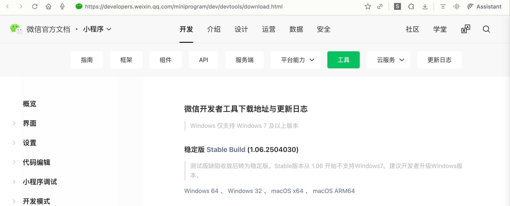
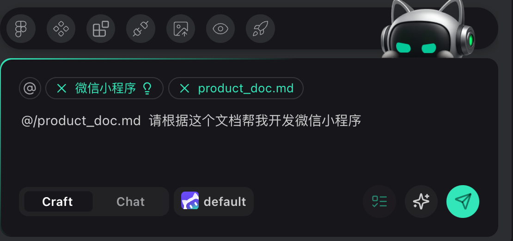
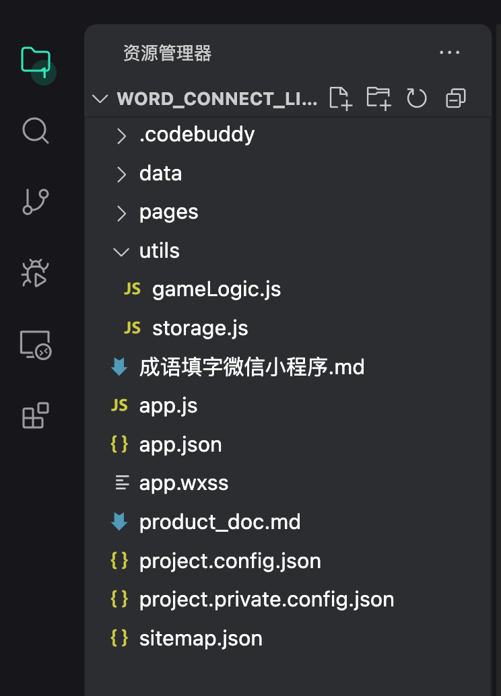
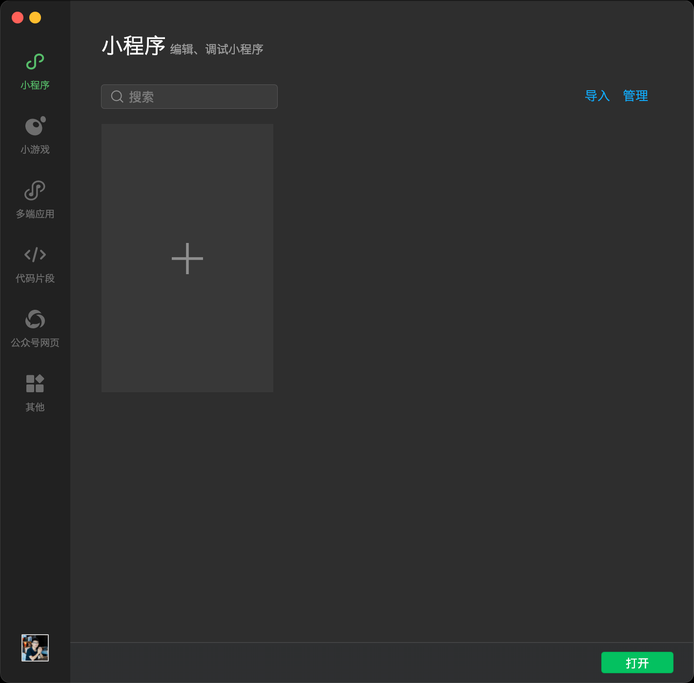
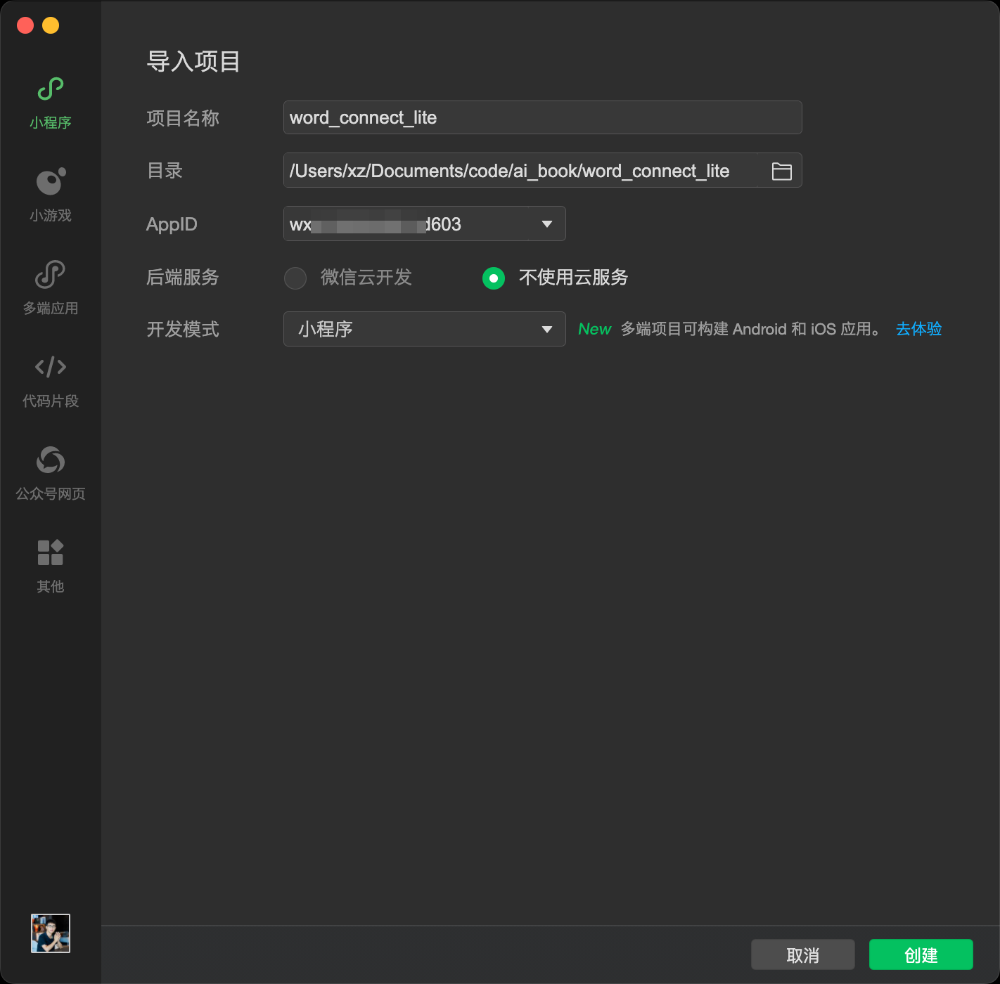
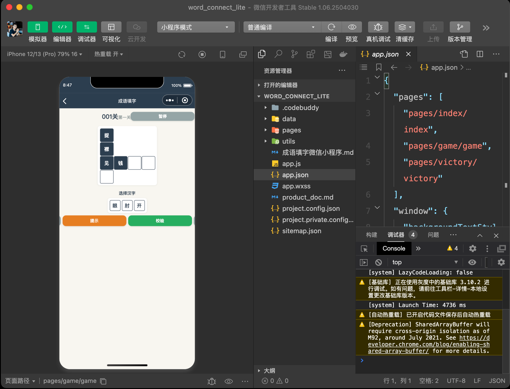
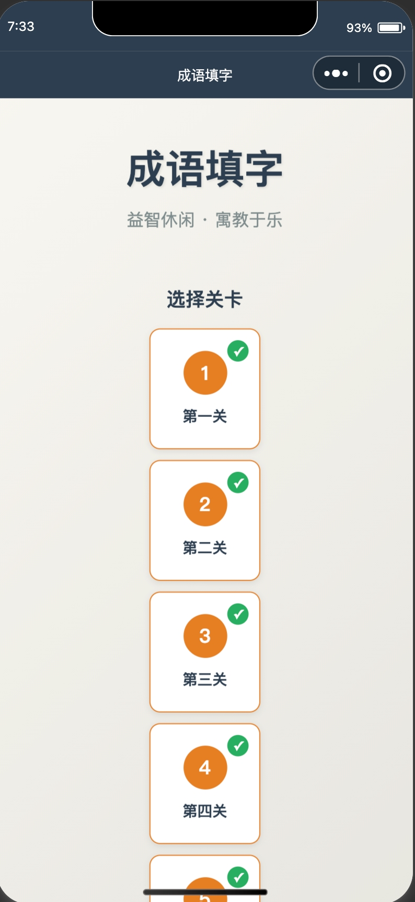
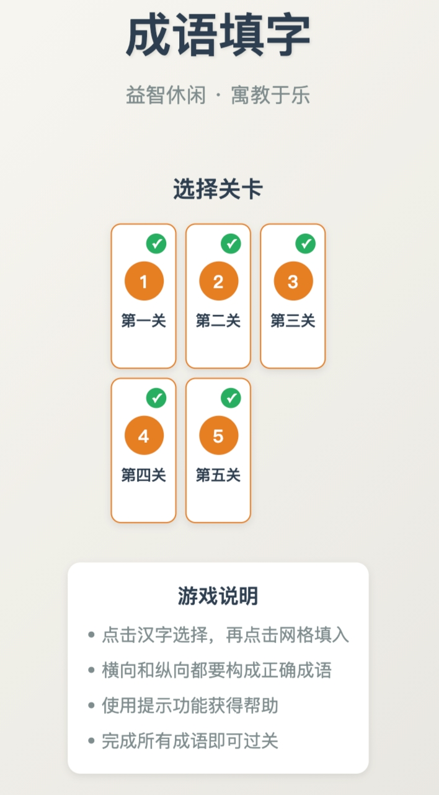

## 10.3-微信小程序实战

“灵感像风，总在最紧张的时刻拂面而来。”
新学期和粉丝节的节点兵临城下，品牌比拼的不再只是速度，而是能否在有限人手下交出有温度的互动。随着家长和粉丝期待值水涨船高，任何延误都会错失第一波口碑。
• 活动上线倒计时，团队却在素材、玩法和流程之间疲于奔命；
• 设计与运营排期冲突，脑中有故事却无力快速落地；
• 细节来不及推敲，担心上线后体验不稳重创信任；
• 合作伙伴多线协作，沟通成本和返工成本双双飙升；

本节将通过两个实战故事，帮你在紧迫项目中稳住节奏、做出吸睛玩法，并把临时任务变成品牌高光时刻。

### 10.3.1 成语接龙微信小程序：AI协同实战

产品运营经理林青负责打造一款寓教于乐的成语接龙微信小程序，目标是在新学期活动前向小学家长展示互动课程。团队成员需要同时兼顾题库整理、界面设计与玩法平衡，但时间仅剩三天，传统手工迭代难以满足进度。为了降低开发风险，林青决定依托腾讯 CodeBuddy 的对话式协作能力生成代码并校正算法。

项目初稿很快暴露难点：关卡数量、提示逻辑与本地存档等细节尚未敲定，而核心的成语接龙算法稍有偏差就会导致玩法崩塌。林青必须回答一个关键问题：如何在保持品质的前提下，让AI在极短时间内构建并完善这款小程序？

####  1. 需求分析与MVP流程

为了验证成语接龙游戏的最小可行产品，团队将核心操作拆解为用户视角的业务流程图，如图10-3-1-1所示，确保AI生成代码时保持统一交互逻辑。


图10-3-1-1 成语接龙小程序业务流程图


####  2. 准备阶段

在执行AI自动化开发前，团队完成必备的基础设施配置，如图10-3-1-2所示的微信开发者工具帮助快速搭建调试环境。



图10-3-1-2 微信小程序开发工具下载界面


- 安装微信开发者工具并使用测试号登录，创建空白小程序项目。
- 注册并登录腾讯 CodeBuddy，启用内置小程序知识库以及 Tencent CloudBase 支持。
- 在本地创建 `word_connect_lite` 文件夹，用于存放 AI 生成的前端与逻辑代码。

####  3. 根据需求撰写MVP提示词

林青首先整理玩法要点，利用原始提示词引导 CodeBuddy 明确关卡数量、提示比例与交互方式。该提示词直接粘贴至对话窗口，触发AI对需求的追问与归纳。

```text
我想开发一个成语接龙微信小程序游戏。一共有5关，第一关有2个成语，每增加一关增加一个成语，每个成语4个字，每关有50%的汉字是需要填写的。请帮我把需求拆解清楚，并输出一段可以直接复制给您的详细提示词；如果有不确定的细节请先向我确认。
```

AI 不断确认难度控制、提示机制与界面风格后，形成完整的产品需求草稿，为下一步生成代码奠定基础。

####  4. AI优化提示词

结合 CodeBuddy 的提问，团队将所有反馈整合为结构化 PRD，确保每个模块都能转化为明确的开发任务，同时约束AI输出统一的界面布局、存档策略与辅助功能。

```text
成语填字小程序 V1.0 产品需求文档 (PRD)

1. 产品概述
产品名称：成语填字
平台：微信小程序
产品目标：提供一款核心玩法简单、关卡设计循序渐进的休闲益智成语填字游戏。

2. 核心玩法与关卡设计
基本玩法：玩家通过选择汉字，填满谜题网格中的所有空格，使横向和纵向的汉字都构成正确的四字成语。
关卡设计：游戏采用线性闯关模式，共计5个关卡。每个关卡都将比前一关增加一个成语，同时谜题网格中也会增加一个交集汉字。
第一关（2个成语）：
    成语：《见钱眼开》《捉襟见肘》
    交集汉字：见
    提示逻辑：谜题网格中会有50%的汉字是已填好的，其余50%需要玩家填写。每个成语最少会显示一个汉字给用户。
第二关（3个成语）：
    成语：《开门见山》《见钱眼开》《有口无心》
    交集汉字：见、开
    提示逻辑：谜题网格中会有50%的汉字是已填好的，其余50%需要玩家填写。每个成语最少会显示一个汉字给用户。
第三关（4个成语）：
    成语：《开门见山》《见钱眼开》《有口无心》《山穷水尽》
    交集汉字：见、开、山
    提示逻辑：谜题网格中会有50%的汉字是已填好的，其余50%需要玩家填写。每个成语最少会显示一个汉字给用户。
第四关（5个成语）：
    成语：《开门见山》《见钱眼开》《有口无心》《山穷水尽》《水落石出》
    交集汉字：见、开、山、水
    提示逻辑：谜题网格中会有50%的汉字是已填好的，其余50%需要玩家填写。每个成语最少会显示一个汉字给用户。
第五关（6个成语）：
    成语：《开门见山》《见钱眼开》《有口无心》《山穷水尽》《水落石出》《石破天惊》
    交集汉字：见、开、山、水、石
    提示逻辑：谜题网格中会有50%的汉字是已填好的，其余50%需要玩家填写。每个成语最少会显示一个汉字给用户。

3. 用户界面（UI）与交互（IX）需求
游戏主界面：
    顶部信息：顶部居中显示当前关卡编号（例如“001关”）。
    谜题网格：屏幕中央展示由汉字方块和空白方块组成的谜题网格。已填入的汉字不可点击，空白方块是玩家交互的目标。
    操作区：屏幕下方展示本关所有待选汉字，这些汉字只包含正确答案，不包含干扰汉字。
核心交互：
    填入：玩家点击待选汉字，然后点击谜题网格中的空格，即可将汉字填入。为了简化操作，V1.0 版本无需实现拖拽功能。
    撤销：玩家可以点击谜题网格中自己填入的汉字，将其返回到待选汉字区，腾出空格。
    校验：只有当谜题网格中的所有空格都被填满后，系统才进行一次性校验。如果所有成语都正确，则自动进入过关流程。如果存在错误，玩家可以继续调整。
辅助按钮：
    “提示”按钮：每次点击，随机揭示网格中一个未填入的正确汉字，不设使用次数限制。
    “暂停”按钮：点击后弹出菜单，提供“继续游戏”和“退出关卡”选项。

4. 进度存储与过关流程
本地存储：使用 `wx.setStorageSync` 保存玩家当前进度，包括最高已通过关卡以及当前关卡的填写状态。
过关界面：当玩家成功填对所有成语后，显示“恭喜过关”界面，并列出本关所有完成的成语列表。
下一步操作：界面提供“下一关”按钮，点击后直接加载并进入下一关游戏。
```

####  5. 使用CodeBuddy生成应用

基于优化后的 PRD，工程师在 CodeBuddy 中打开 `word_connect_lite` 目录，新建 `product_doc.md` 并粘贴最终提示词，然后请求生成完整小程序代码。指令发送界面如图10-3-1-3所示，自动生成的项目结构如图10-3-1-4所示，包含页面、样式与逻辑文件。



图10-3-1-3 CodeBuddy 接收生成指令的界面



图10-3-1-4 成语接龙小程序的代码骨架

随后，团队在微信开发者工具中创建小程序项目并导入生成代码。启动界面如图10-3-1-5所示，选择本地目录与加载文件的过程分别见图10-3-1-6和图10-3-1-7，确保资源路径与配置文件正确识别。



图10-3-1-5 启动微信小程序开发环境



图10-3-1-6 选择本地成语接龙代码目录



图10-3-1-7 导入后的项目预览效果

在预览阶段，设计团队发现关卡选择页面排布过于松散，如图10-3-1-8所示。通过追加样式调整提示，界面一行可容纳三个关卡，优化结果见图10-3-1-9。该提示在 CodeBuddy 中执行如下：

```text
请修改样式，选择关卡页面，一行要放3个关卡。
```



图10-3-1-8 优化前的关卡排布



图10-3-1-9 优化后的关卡排布

**Bug修复**  
首次生成的成语接龙算法未能保证首尾字连贯，导致闯关逻辑失效。团队在 CodeBuddy 中多轮补充提示，例如强调“首尾字必须相连”“填字校验需一次性完成”，并将样例数据粘贴进对话窗口，最终一次性修复算法。实践证明，在反复描述期望逻辑的过程中，清晰的测试案例与约束条件能够显著提升 CodeBuddy 的问题定位能力。

####  6. 举一反三：延展应用场景

该项目的方法论表明，只要定义清晰的提示词与流程，AI 即可快速交付互动式学习应用。基于相同思路，还可以拓展以下场景：

- **古诗填空训练助手**：依据课本诗词生成填空网格与提示，帮助学生巩固背诵成果。
- **英语词汇拼写闯关**：将词根词缀拆分为拼图，结合提示按钮强化记忆与练习。
- **历史事件时间轴挑战**：以时间节点为卡片，要求用户按顺序排列，并提供智能提示与错题订正。


### 10.3.2 AI表情包微信小程序开发实战指南

运营团队负责人林舟在准备品牌粉丝节活动时，需要短时间内制作一批统一风格的表情包，以活跃社群氛围并引导粉丝二次分享。设计师排期紧张，前端同事又担心小程序迭代时间过长，项目一度陷入僵局。林舟看到微信生态对 AI 创意工具的需求持续升温，决心把表情包制作流程交给腾讯 CodeBuddy 与通义千问图生图模型协作完成。


运营团队按照活动主题设置多款贴纸模板，让粉丝上传头像即可生成专属表情。正式版本进一步优化了操作提示和失败兜底逻辑，确保用户无论在高峰期还是弱网环境下都能顺利完成创作。相关界面示例将在“使用CodeBuddy生成应用”一节中展示。


---

#### 1. 需求分析与MVP流程

如图10-3-2-1所示。


图10-3-2-1 需求分析与MVP流程界面


以下流程图描述了 AI 表情包小程序的核心业务路径，从头像上传到生成贴纸并保存的全过程。


整体 MVP 聚焦七个关键动作：上传头像、挑选表情、确认生成、等待反馈、查看预览、保存图片、分享成果。团队通过 CodeBuddy 统一维护提示词，可快速复现页面布局、交互提示与云端调用说明，减少手写代码与跨部门沟通成本。

#### 2. 准备阶段

项目在启动前完成了基础环境的搭建与账号开通，确保 CodeBuddy 能够在一次对话中生成可用的微信小程序工程。

- 微信开发者工具：登录微信公众平台官网下载桌面端工具，使用测试号或正式 AppID 创建项目，并在“云开发”面板中启用环境、记录环境 ID 与基础配置信息。
- 阿里云百炼账号：访问 https://bailian.console.aliyun.com 启用通义千问图生图模型，申请专用 API Key

#### 3. 根据需求撰写MVP提示词

林舟整理运营目标、互动流程与资源准备情况后，使用结构化提示词驱动 CodeBuddy 逐项追问需求，并输出可执行的开发方案。


全部提示词以代码块形式保存，便于在不同会话中复用。原始提示词如下：

```markdown
# 项目简介：
我想开发一个“AI表情包”微信小程序。 

# 核心流程： 
- 用户上传人物、动物或卡通头像； 
- 选择 9 种表情中的一个（开心、大笑、哭泣、生气、惊讶、疑惑、害羞、得意、无语）； 
- 调用阿里云通义千问图生图模型生成一张透明背景、风格统一的表情贴纸； 
- 支持保存到手机。 

# 核心说明：
项目的云端能力全部使用微信云开发 CloudBase，实现云存储（上传原图与生成图）和云函数（安全调用通义千问 API）；

# 功能范围
当前版本不做历史记录页面。
```


#### 4. AI优化提示词

把上面的提示词给到AI进一步细化，并添加接口文档的说明

```markdown
# 微信小程序产品文档（AI表情包自动生成）

## 一、产品目标

开发一个基于 **AI 表情包生成** 的微信小程序。
用户上传人物、动物或卡通头像，系统通过 **通义千问图生图大模型** 自动生成统一风格、夸张表情的微信表情包，支持一键保存到手机。

---

## 二、核心说明

* **生成方式**：调用 **通义千问（图生图模型）**，将上传图片转换为卡通化风格表情。
* **身份一致性**：模型会保持人物/动物/头像的核心特征，使生成的不同的表情属于同一形象。

---

## 三、用户需求

* **输入类型**

  1. 人脸照片
  2. 动物照片
  3. 其他卡通头像（动漫人物、虚拟形象、插画头像）

* **输出结果**

  * 一张卡通风格表情包
  * 覆盖 9 种常用表情：开心、大笑、哭泣、生气、惊讶、疑惑、害羞、得意、无语
  * 图片格式：透明 PNG，分辨率 512×512
  * 风格统一，表情夸张，无文字

---

## 四、用户流程

1. 上传单张图片（人脸 / 动物 / 卡通头像）
2. 单选框：选择表情关键词
3. 系统调用 通义千问大模型 生成 1 张表情包
4. 支持单张保存或一键保存整组到相册

## 接口相关
通义千问接口文档请参考当前目录中的 @ai-api.md 文件

```


通义千问图生图接口文档和apikey，请替换下面的apikey值，把下面的接口文档保存成一个 ai-api.md 文件

````markdown
# 通义千问图生图接口文档和apikey

## 入参中的apikey为：sk-xxxxxxxx 

## 入参：
curl --location 'https://dashscope.aliyuncs.com/api/v1/services/aigc/multimodal-generation/generation' \
--header 'Content-Type: application/json' \
--header "Authorization: Bearer <apikey>" \
--data '{
    "model": "qwen-image-edit",
    "input": {
        "messages": [
            {
                "role": "user",
                "content": [
                    {
                        "image": "https://cdnv2.ruguoapp.com/FnQFa_XYgg09Z_wEVzgZLdlUpFD1v3.jpg?imageMogr2/auto-orient/heic-exif/1/format/jpeg/thumbnail/!1000x1000r/gravity/Center/crop/!1000x1000a0a0"
                    },
                    {
                        "text": "生成一个透明背景的卡通风微信贴纸。人物身份、服装必须和参考图一致，保留长相、发型、配饰和配色。背景简单干净，无文字。表情要自然、有感染力，体现开心的笑容、明亮的眼睛和活泼的情绪。"
                    }
                ]
            }
        ]
    },
    "parameters": {
        "negative_prompt": " ",
        "watermark": false
    }
}'


## 出参：
```
{
    "output": {
        "choices": [
            {
                "finish_reason": "stop",
                "message": {
                    "content": [
                        {
                            "image": "https://dashscope-result-sh.oss-cn-shanghai.aliyuncs.com/7d/55/20251006/6296b724/26c584a9-1310-4e26-a5ab-b1a50d1e3402-1.png?Expires=1760361427&OSSAccessKeyId=LTAI5tKPD3TMqf2Lna1fASug&Signature=P1bs022x7EtanE6RLIVakQ8V5qA%5C"
                        }
                    ],
                    "role": "assistant"
                }
            }
        ]
    },
    "usage": {
        "height": 1024,
        "image_count": 1,
        "width": 1024
    },
    "request_id": "0288912e-7544-4492-9ed5-1df29f6bfda1"
}
```
````


#### 5. 使用CodeBuddy生成应用


图10-3-2-2 AI表情包小程序生成结果


.png)

图10-3-2-3 生成后的贴纸预览与下载按钮


#### 6. 举一反三：延展应用场景

表情包小程序的实现路径具有高度可复制性，可拓展至更多创意生产与活动运营场景：
- **品牌角色合成助手**：基于品牌主视觉元素自动生成社交平台分享图，加速新品宣传节奏。  
- **互动抽奖设计器**：将用户头像与奖品模板合成动态贴纸，用于微信群抽奖与话题热身。  
- **教育场景表情库**：教师上传学生头像，快速创建课堂反馈贴纸，增加互动趣味。  
- **节日海报批量工具**：将企业员工头像与节日模板结合，生成节日问候图，适配内部社群与外部宣传。

