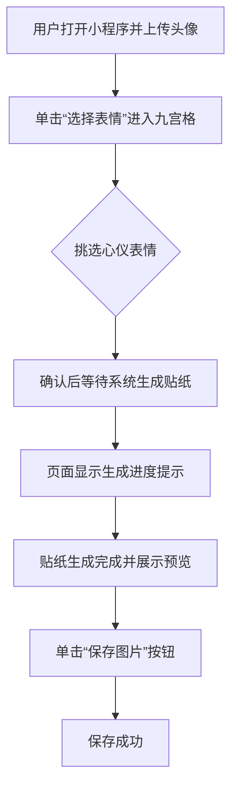

### 10.3.2 AI表情包微信小程序开发实战指南

运营团队负责人林舟在准备品牌粉丝节活动时，需要短时间内制作一批统一风格的表情包，以活跃社群氛围并引导粉丝二次分享。设计师排期紧张，前端同事又担心小程序迭代时间过长，项目一度陷入僵局。林舟看到微信生态对 AI 创意工具的需求持续升温，决心把表情包制作流程交给腾讯 CodeBuddy 与通义千问图生图模型协作完成。


运营团队按照活动主题设置多款贴纸模板，让粉丝上传头像即可生成专属表情。正式版本进一步优化了操作提示和失败兜底逻辑，确保用户无论在高峰期还是弱网环境下都能顺利完成创作。相关界面示例将在“使用CodeBuddy生成应用”一节中展示。


---

#### 1. 需求分析与MVP流程

如图10-3-2-1所示。


图10-3-2-1 需求分析与MVP流程界面


以下流程图描述了 AI 表情包小程序的核心业务路径，从头像上传到生成贴纸并保存的全过程。



整体 MVP 聚焦七个关键动作：上传头像、挑选表情、确认生成、等待反馈、查看预览、保存图片、分享成果。团队通过 CodeBuddy 统一维护提示词，可快速复现页面布局、交互提示与云端调用说明，减少手写代码与跨部门沟通成本。

#### 2. 准备阶段

项目在启动前完成了基础环境的搭建与账号开通，确保 CodeBuddy 能够在一次对话中生成可用的微信小程序工程。

- 微信开发者工具：登录微信公众平台官网下载桌面端工具，使用测试号或正式 AppID 创建项目，并在“云开发”面板中启用环境、记录环境 ID 与基础配置信息。
- 阿里云百炼账号：访问 https://bailian.console.aliyun.com 启用通义千问图生图模型，申请专用 API Key

#### 3. 根据需求撰写MVP提示词

林舟整理运营目标、互动流程与资源准备情况后，使用结构化提示词驱动 CodeBuddy 逐项追问需求，并输出可执行的开发方案。


全部提示词以代码块形式保存，便于在不同会话中复用。原始提示词如下：

```markdown
# 项目简介：
我想开发一个“AI表情包”微信小程序。 

# 核心流程： 
- 用户上传人物、动物或卡通头像； 
- 选择 9 种表情中的一个（开心、大笑、哭泣、生气、惊讶、疑惑、害羞、得意、无语）； 
- 调用阿里云通义千问图生图模型生成一张透明背景、风格统一的表情贴纸； 
- 支持保存到手机。 

# 核心说明：
项目的云端能力全部使用微信云开发 CloudBase，实现云存储（上传原图与生成图）和云函数（安全调用通义千问 API）；

# 功能范围
当前版本不做历史记录页面。
```


#### 4. AI优化提示词

把上面的提示词给到AI进一步细化，并添加接口文档的说明

```markdown
# 微信小程序产品文档（AI表情包自动生成）

## 一、产品目标

开发一个基于 **AI 表情包生成** 的微信小程序。
用户上传人物、动物或卡通头像，系统通过 **通义千问图生图大模型** 自动生成统一风格、夸张表情的微信表情包，支持一键保存到手机。

---

## 二、核心说明

* **生成方式**：调用 **通义千问（图生图模型）**，将上传图片转换为卡通化风格表情。
* **身份一致性**：模型会保持人物/动物/头像的核心特征，使生成的不同的表情属于同一形象。

---

## 三、用户需求

* **输入类型**

  1. 人脸照片
  2. 动物照片
  3. 其他卡通头像（动漫人物、虚拟形象、插画头像）

* **输出结果**

  * 一张卡通风格表情包
  * 覆盖 9 种常用表情：开心、大笑、哭泣、生气、惊讶、疑惑、害羞、得意、无语
  * 图片格式：透明 PNG，分辨率 512×512
  * 风格统一，表情夸张，无文字

---

## 四、用户流程

1. 上传单张图片（人脸 / 动物 / 卡通头像）
2. 单选框：选择表情关键词
3. 系统调用 通义千问大模型 生成 1 张表情包
4. 支持单张保存或一键保存整组到相册

## 接口相关
通义千问接口文档请参考当前目录中的 @ai-api.md 文件

```


通义千问图生图接口文档和apikey，请替换下面的apikey值，把下面的接口文档保存成一个 ai-api.md 文件

````markdown
# 通义千问图生图接口文档和apikey

## 入参中的apikey为：sk-xxxxxxxx 

## 入参：
curl --location 'https://dashscope.aliyuncs.com/api/v1/services/aigc/multimodal-generation/generation' \
--header 'Content-Type: application/json' \
--header "Authorization: Bearer <apikey>" \
--data '{
    "model": "qwen-image-edit",
    "input": {
        "messages": [
            {
                "role": "user",
                "content": [
                    {
                        "image": "https://cdnv2.ruguoapp.com/FnQFa_XYgg09Z_wEVzgZLdlUpFD1v3.jpg?imageMogr2/auto-orient/heic-exif/1/format/jpeg/thumbnail/!1000x1000r/gravity/Center/crop/!1000x1000a0a0"
                    },
                    {
                        "text": "生成一个透明背景的卡通风微信贴纸。人物身份、服装必须和参考图一致，保留长相、发型、配饰和配色。背景简单干净，无文字。表情要自然、有感染力，体现开心的笑容、明亮的眼睛和活泼的情绪。"
                    }
                ]
            }
        ]
    },
    "parameters": {
        "negative_prompt": " ",
        "watermark": false
    }
}'


## 出参：
```
{
    "output": {
        "choices": [
            {
                "finish_reason": "stop",
                "message": {
                    "content": [
                        {
                            "image": "https://dashscope-result-sh.oss-cn-shanghai.aliyuncs.com/7d/55/20251006/6296b724/26c584a9-1310-4e26-a5ab-b1a50d1e3402-1.png?Expires=1760361427&OSSAccessKeyId=LTAI5tKPD3TMqf2Lna1fASug&Signature=P1bs022x7EtanE6RLIVakQ8V5qA%5C"
                        }
                    ],
                    "role": "assistant"
                }
            }
        ]
    },
    "usage": {
        "height": 1024,
        "image_count": 1,
        "width": 1024
    },
    "request_id": "0288912e-7544-4492-9ed5-1df29f6bfda1"
}
```
````


#### 5. 使用CodeBuddy生成应用


图10-3-2-2 AI表情包小程序生成结果


.png)

图10-3-2-3 生成后的贴纸预览与下载按钮


#### 6. 举一反三：延展应用场景

表情包小程序的实现路径具有高度可复制性，可拓展至更多创意生产与活动运营场景：
- **品牌角色合成助手**：基于品牌主视觉元素自动生成社交平台分享图，加速新品宣传节奏。  
- **互动抽奖设计器**：将用户头像与奖品模板合成动态贴纸，用于微信群抽奖与话题热身。  
- **教育场景表情库**：教师上传学生头像，快速创建课堂反馈贴纸，增加互动趣味。  
- **节日海报批量工具**：将企业员工头像与节日模板结合，生成节日问候图，适配内部社群与外部宣传。
