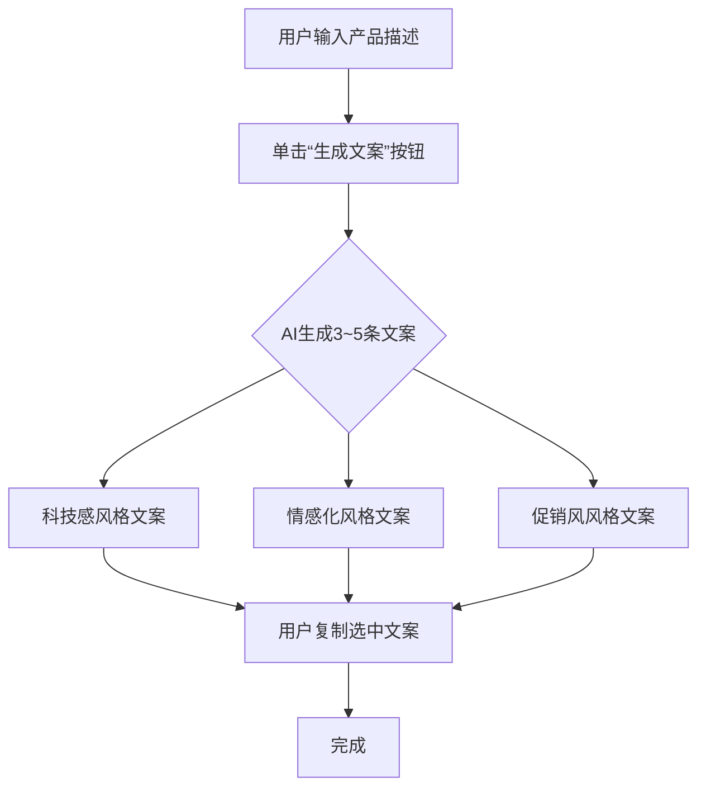

请严格按照以下出版模板结构改写或重构我提供的文章内容。  
生成的整篇文章需以 **Markdown 格式输出**，并遵循以下写作要求：

- 标题从“###”开始，除开篇故事段落外，正文内各子章节标题统一使用“####”，并为每个“####”标题添加连续编号（从“#### 2. …”开始）。  
- 所有提示词（Prompt）必须放在独立代码块中。  
- 全文采用第三人称叙述，语气正式自然，逻辑清晰。  
- 禁止出现第一、二人称（如“我”“我们”“你们”“您”等）。  
- 插图引用格式统一为：“如图X-Y所示”，图下方附图注（不使用斜体），并确保插图占位与图注上下各保留一行空行，便于Markdown正常显示。  
- 使用规范动作词汇：  
  * “执行……命令” 或 “选择……命令”；  
  * 对话框、窗口使用“打开”；  
  * 快捷菜单、下拉列表使用“弹出”；  
  * 所有“点击”统一改为“单击”，右键操作统一表述为“右击”。  
- 输出逻辑严谨、段落紧凑，适合书籍出版。  

-------------------------------
# 📘 AI项目实战文章结构模板（出版级 V10）

> *本节不加标题说明，仅叙述内容*  
通过第三人称的故事引出问题与需求，聚焦角色在业务或日常生活中遭遇的真实痛点，例如缺乏编程能力以致无法搭建关键工具。  
强调使用AI编程可以快速生成可用解决方案，通过开发应用有效缓解或解决上述难题。  
结尾提出关键问题或转折，引出AI自动化思路。  

---

#### 2. 需求分析与MVP流程  
本节展示项目的核心业务逻辑。请在正文开头插入“如图X-Y所示”描述，并保留如下占位符，便于单独添加本节的首张截图：  
> “如图X-Y所示。”  
>   
> （此处插图占位）  
>   
> 图X-Y 需求分析与MVP流程界面  
>   

以下流程图描述了AI营销文案生成器的基本工作过程，从用户输入到AI生成多种风格文案并完成选择的全过程。  

业务流程图如下所示（可复制至 https://mermaid.live 查看）：

说明：  
- 此图为**业务流程图**（非技术实现流程）。  
- 重点体现用户与AI的交互逻辑与输出路径。  
- 所有节点名称应采用简体中文，保持出版格式一致。  
- 图中“单击”符合操作规范，不使用“点击”。  

---

#### 3. 准备阶段  
说明AI自动化编程前的基础准备。  
由AI自动生成项目结构、配置变量与`.env`文件。  
若AI功能受限，需要申请API Key以调用外部接口。  
本节重点在逻辑理解，而非技术操作。

---

#### 4. 根据需求撰写MVP提示词  
展示如何围绕MVP核心功能编写Prompt。  
内容需明确目标、输入、输出要求，语言简洁、逻辑清晰。  
提示词示例：
```markdown
角色：AI应用构建助手  
任务：生成一个可自动编写短视频脚本的工具。  
目标：输入主题后，AI生成视频脚本（包括标题、镜头内容、旁白）。  
输出：输出脚本的JSON结构，包含3个镜头内容。
```

---

#### 5. AI优化提示词  
说明AI如何在交互逻辑、设计风格与功能明确性方面进一步完善Prompt。  
采用段落说明AI的优化思路与改进逻辑，避免使用对比表。  
优化后Prompt示例：
```markdown
角色：智能界面生成助手  
目标：根据输入任务说明生成交互式网页界面。  
风格：现代简约风格，采用卡片布局与清晰按钮。  
输出：返回完整HTML代码，包含交互逻辑与样式注释。
```

---

#### 6. 使用CodeBuddy生成应用  
展示AI根据提示词生成应用界面与逻辑的全过程。  
截图引用格式如下：  
> “生成的应用界面如图5-24所示。”  
>   
> （此处插图占位）  
>   
> 图5-24 Lovable 生成的转化率优化工具  
> 

**Bug修复（可选）**  
若AI生成结果出现问题，应在本节说明错误及修复过程。  
如涉及新的修复提示词，请以代码块展示。  
所有截图均使用统一图号与图注格式。

---

#### 7. 举一反三：延展应用场景  
根据当前项目内容生成延展应用场景，帮助读者拓展思维。  
在该模块中：  
- 先以一段简述说明本案例方法的可迁移性（如“此思路同样可应用于……”）；  
- 然后列出若干与当前项目主题相关的延展应用或改进方向；  
- 每个条目简要说明其核心价值与实现目标。  

（示例仅供参考，生成时应根据实际项目内容替换）  
```markdown
- **语音脚本生成助手**：基于文本自动生成配音脚本与语速控制。  
- **AI营销落地页助手**：根据广告素材自动生成网页文案与版式布局。  
- **社交话题分析工具**：自动抓取并分析特定领域的热门话题内容。  
```
-------------------------------
